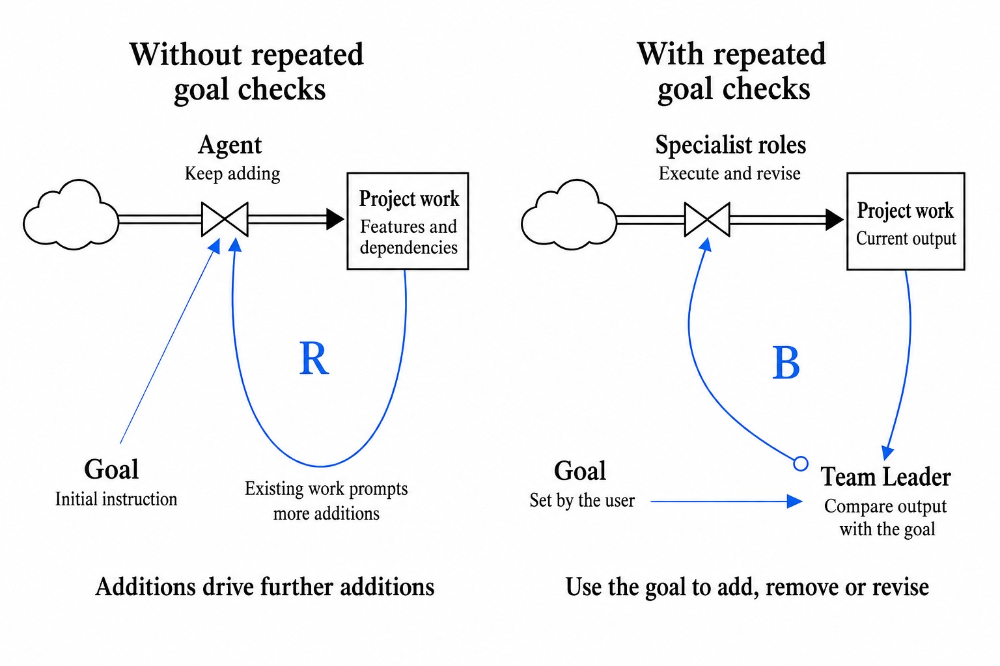
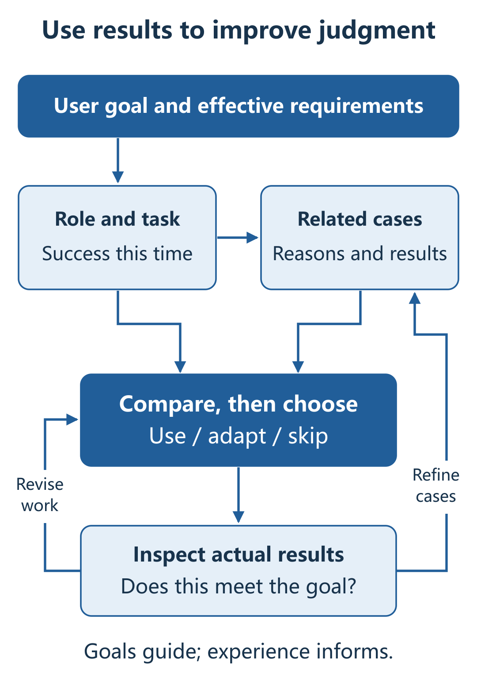
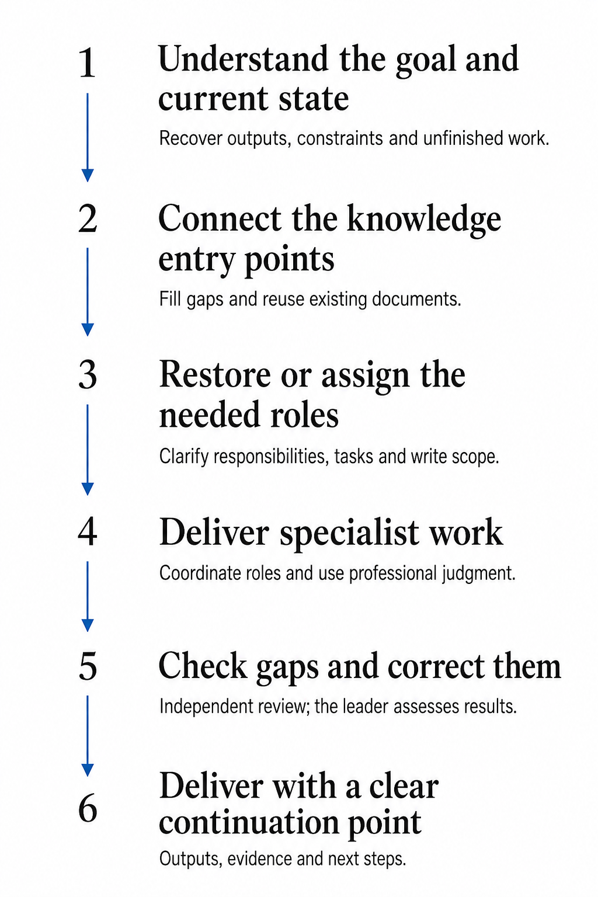

# Give your AI project a lead who keeps the team moving toward your goal

AI Design 996 · Design & practice · Updated September 10, 2026 · First published September 7, 2026

English · [繁體中文](ARTICLE.zh-Hant.md) · [简体中文](ARTICLE.md) · [Share a use case or suggestion](FEEDBACK.en.md)

Sometimes, when I use AI to run a project, I am still the busiest person in it.

A direction has been chosen, but I have to prompt the next step. Two projects need to cooperate, and I carry messages between them. An article reads well after revision, but next time I have to explain the same formatting requirements again.

Writing three recent WeChat posts brought these experiences together: **I want to hand over the continuing work of keeping direction, coordinating people, and using what we have learned.**

That is why I built Team Leader around Astra in Codex. The Skill gives an AI project lead a defined responsibility and a way to think through its work: keep checking the goal, organize appropriate specialist work, and bring relevant experience into the next decision.

This article starts with those everyday problems. Actual interviews and editing records are distinguished from teaching examples. The current formal release is [0.5.23](https://github.com/aidesign996/team-leader/releases/latest); the [installation and update guide](https://github.com/aidesign996/team-leader#start) is maintained on the Skill's main page.

## Give every round of work a way back to the goal

Suppose I want a simple portfolio page where readers can immediately find articles and useful Skills. Categories are added, then filters, then settings for the filters. Every addition has a reason, yet the page becomes harder to understand.

Reinforcing and balancing feedback in *Thinking in Systems* helped me think about this problem.[1][2] In this hypothetical case, existing content generates more requests, which lead to further additions. Temporary ideas, outdated explanations, and unused features also make later decisions harder if they are never removed.

Who keeps asking whether this work still serves the original goal?

**I set the goal. After each round, the lead looks at the actual result, identifies the gap, and organizes a correction.**

*Figure 1. B denotes a balancing loop connecting the goal, feedback from results, and corrective action.*

For that portfolio page, the lead needs to open the page and examine both layout and interaction. If the main content is still hard to find, the relevant specialist receives a concrete problem to fix. The revised result then enters the next review.

*Figure 2. R on the left represents one possible mechanism of scope growth. The right keeps the goal involved in decisions. Ordinary agents do not inevitably drift.*

An ordinary agent can also review its own work. Team Leader makes direction, gap assessment, and follow-through a continuing responsibility. Its value depends on identifying the right problems and actually correcting them.

## Give specialists room to judge, and carry decisions into implementation

A clear goal does not mean I prescribe every step.

When the product is still unclear, different approaches can be explored. When technical routes differ, their conditions and costs need explaining. Once a direction is chosen, implementation is checked against that decision.

*Figure 3. Exploration and convergence. An increase in the number of options is not, by itself, a reinforcing feedback loop.*

**The lead is responsible for organizing and delivering the work. The user retains authority over goals, core tradeoffs, and effective requirements.**

Specialists can point out problems and propose better methods. Routine choices within authorization move forward. A material change to the goal or an important tradeoff comes back with a concrete proposal, reasons, and consequences. An old case cannot silently override an accepted requirement.

## Find the right owner, and let owners connect the work directly

Some project work asks what to make; some asks how to make it; other work involves implementation and checking. The complete team has six responsibilities: lead, environment setup, product design, technical design, development, and independent AI acceptance.

*Figure 4. Numbers identify responsibilities. In complete-team mode, establish the corresponding roles and activate those relevant to each task.*

**Use an appropriate existing professional owner first, including a lead in another project.** Suitable work can be delivered by one person. If a new team is necessary and authorized, establish its complete arrangement. The purpose of the division is to deliver useful work.

Preparing this article involved exactly such a connection. The sharing lead needed to understand the Skill; the development lead knew its design, installation, and validation. If every question went through me, I became their messenger.

I changed the instruction:

> You are responsible for this article. Get the source material directly from the Skill's development lead.

In the actual exchange, the sharing lead asked whether readers could start with a single sentence. The development lead clarified the prerequisites: install and select the Skill, identify the relevant lead, and use an application that supports communication between tasks. The sharing lead then turned those answers into approachable instructions.

*Figure 5. Dashed lines represent communication as needed. Each project keeps its own responsibilities and access boundaries.*

One lead asks how to make the explanation simple; the other checks whether a reader can actually follow it. Asking enough to understand, then continuing to deliver, is what makes the coordination useful.

**This requires communication support in the host and permission to access the relevant material.** Pasting the Skill into an ordinary chat does not connect projects automatically. There is evidence of a specific research exchange here, not proof of an always-running orchestration service.

## Keep experience so the next decision can be better

Another kind of repeated work is teaching the same thing again after it was already fixed.

While editing the WeChat posts, I repeatedly asked for important points to stand out and key conclusions to have their own paragraphs. A later draft still buried a key point in a long paragraph, and I had to point it out again. How could that experience actually help the next piece of work?

In my own work, I first establish whom I am helping, what I am responsible for, and the desired result. Then I recall similar situations and compare whether the earlier approach fits this one.

The arrangement for AI has two layers too: **the role establishes the basis for judgment; a case records why an approach was chosen and what happened.**

Consider the goal of making an article easy to understand. Two situations show why experience cannot consist only of remembering an action:

**A: A key point is buried in a long paragraph.** I say, “Make this sentence bold.” The lead needs to understand why: I want readers to notice the point. A suitable response may be to give it its own paragraph and then add limited emphasis.

The useful lesson describes the conditions, why that approach made sense, and what the revised result was like.

**B: In another article, nearly everything is bold.** Readers still cannot find the main point. Should the lead add even more emphasis? This time it may reduce bold text and combine repeated explanations. The goal is the same, but the action can be the opposite.

This is a teaching comparison based on editing problems, not an experiment comparing three methods. The actual record establishes an omission and a repair; it does not establish reliable autonomous reuse in every later task.

*Figure 6. Two returns: correct the current work against the goal, and refine the original experience using new results.*

**Reuse the basis for an earlier decision, then decide what fits this situation.**

The revised output still needs checking. If the problem remains, keep fixing it. If the new result reveals that an old method only works under certain conditions, add those conditions to the original case. Failure can provide a useful lesson; repeated feedback with no new learning does not need another entry.

This is what I mean by becoming more useful with experience: understanding my intention better, comparing changed conditions, and adapting the method. It is a work design to be tested in actual behavior, not model retraining or a promise of permanent memory and no omissions.

## After installation, start with the work in front of you

You do not need to prepare an elaborate assignment. Give this instruction to an AI tool with web and project-file access:

> Read https://github.com/aidesign996/team-leader, install the complete Team Leader Skill from its latest formal release, and tell me the version actually installed.

Select Team Leader in the project, or mention `$team-leader`, then say:

> Take responsibility for this and keep it moving. Keep useful experience from the work, and look it up when a similar situation comes along.

For an existing project, the lead should recover the goal, completed work, and unfinished tasks. If you only have an idea, explain what you want to do. Essential missing conditions can be clarified without having you plan every step.

*Figure 7. Existing projects should continue from their actual work, records, and roles.*

**A new release does not automatically update your installed Skill.**

If you have already installed it, you can say:

> Check the latest formal release. Preserve the old package and custom changes, then update the complete Skill. Keep project records, accepted requirements, and unfinished tasks. Have the existing lead read the applicable changes and continue toward the original goal.

Use the [current Skill guide](https://github.com/aidesign996/team-leader#start) for the complete package and update instructions. Codex supports personal Skills under `~/.agents/skills/` and project Skills under `.agents/skills/`; retain the whole Skill folder and its relative references.[3]

## Give goals and experience a reliable place to be found

Information buried in a long chat can still be hard to recover. Different kinds of content have a known home, along with rules for when to read and update them.

*Figure 8. The knowledge responsibilities in the supplied templates. Existing projects can retain their own effective entry points.*

`AGENTS.md` sets shared rules and reading routes. 
`roles/` describes each role's contribution to the project goal. 
Product, technical, and acceptance agreements preserve accepted requirements. 
`docs/METHODOLOGY.md` links situations to methods, cases, and results. 
Existing entry points such as `README.md` and `PROGRESS.md` preserve current status and the next step.

**Effective requirements must be followed within their scope. Optional methods and cases are what we assess for reuse.**

“Use blue this time” and “Always make this understandable for beginners” have different scopes and may belong in different places. AI can help organize them, but cannot discard an effective requirement because it expects little future use.

A saved file is only a starting point. Actual retrieval, comparison, and use in a later result demonstrate whether the experience helped.

## Judge models and effort by the work they produce

Team Leader is primarily designed and used with GPT-6 Astra in Codex on Windows. OpenAI's current guidance notes Astra's sensitivity to instructions, possible under-delegation, and tendency to over-test small tasks. This informs my choice to clarify responsibilities and outcomes while keeping the process proportionate.[4]

There is also experience with Sol in some specialist roles: Sol/high handled product work in a 0.5.11 prototype and a 0.5.14 visual revision, with Astra roles carrying subsequent work. Those records retain their original versions and scope. They are not a controlled comparison of all-Astra and all-Sol teams. Official model capabilities are also distinct from validation of this Skill.[5]

**Respect the user's chosen model and effort first. Allocate effort only within the authority already given.**

Under the adopted automatic allocation in 0.5.23, the lead usually starts at `high`. Clear small changes may use `medium`; substantive design and acceptance use `high` as complexity warrants; clearly difficult work can start directly at `xhigh`. Higher investment needs a concrete reason, and available controls depend on the host.

The lead's usual starting point changed in 0.5.19. The earlier `xhigh` default should not be presented as current advice. Historical records still report the settings actually used.

The lead should examine the complete result and critical issues. Supported sampling of similar low-risk items and reuse of unchanged evidence can reduce repetition. Independent AI acceptance remains separate from developer self-checks and is performed by a role that did not primarily implement the item. Higher effort, more checks, and longer output do not substitute for a useful result.

Coordination, validation, and rework all cost time and quota. There is no reliable overall savings percentage yet. The useful questions are final quality, the amount of rework, and which repeated conversations were actually avoided.

## Bring real problems back so we can improve the method

These recent projects include a documented exchange between leads, but also formatting omissions repaired after user reminders. Version 0.5.23 puts goal authority, effective requirements, experience retrieval, and result-based revision into the protocol and templates. It passed package-consistency checks and four file-based scenarios. Adoption by five project leads was checked; two required reminders to finish continuing the work.

Those results establish particular accomplishments and leave questions worth observing. Passing a synthetic scenario, completing a prompted repair, and working reliably over time are different outcomes. Automatic completeness and fixed time or quota savings are not established.

**I want less prompting, relaying, and reteaching, and more discussion of the goal and the result.**

If something feels awkward, describe what you were doing, what the lead did, and where you still had to step in. You do not need to write a technical report. Useful experiences are welcome too.

[Comment below the article](FEEDBACK.en.md) · [Join the public GitHub discussion](https://github.com/aidesign996/ai-practice/discussions/1)

I will continue improving the Skill using these situations. Start with the [latest formal release](https://github.com/aidesign996/team-leader/releases/latest), and use the [change history](https://github.com/aidesign996/team-leader/blob/main/CHANGELOG.md) to see what changed and what it affects.

## References

1. Donella H. Meadows, *Thinking in Systems: A Primer*, edited by Diana Wright, 2008. [Publisher](https://chelseagreen.co.uk/book/thinking-in-systems/).
2. Donella Meadows, [Leverage Points: Places to Intervene in a System](https://donellameadows.org/archives/leverage-points-places-to-intervene-in-a-system/). Feedback loops inform the work design here; the illustrations are not a quantitative system model.
3. OpenAI, [Codex customization: Skills](https://learn.chatgpt.com/zh-Hans/docs/customization/overview#技能), covering personal and project Skill locations and invocation. Checked September 10, 2026.
4. OpenAI, [GPT-6 Astra guidance](https://developers.openai.com/api/docs/guides/latest-model?model=gpt-6-astra), including instruction following, delegation, and proportionate validation. Checked September 10, 2026.
5. OpenAI, [GPT-5.6 Sol model](https://developers.openai.com/api/docs/models/gpt-5.6-sol). Official capabilities and project-specific practice are separate evidence. Checked September 10, 2026.
