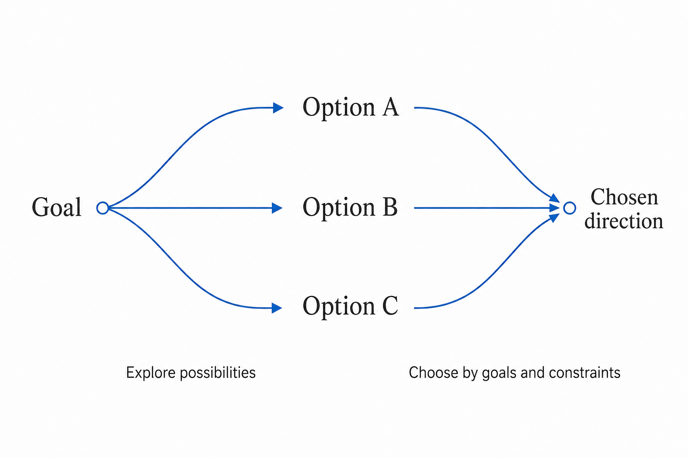
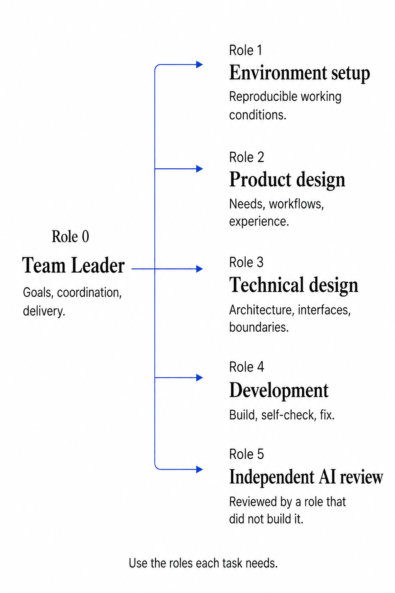

# Team Leader: How AI teams collaborate, correct course, and learn from experience

AI Design 996 · Design & practice · Updated September 11, 2026 · First published September 7, 2026

English · [繁體中文](ARTICLE.zh-Hant.md) · [简体中文](ARTICLE.md) · [Share a use case or suggestion](FEEDBACK.en.md)

**Team Leader is a way of organizing AI teamwork, delivered as a Skill: organize specialist work around the user's goal, improve results through feedback, and bring practical experience into the next decision.**

This article starts with the product goal and systems thinking, explains how responsibilities, cross-project collaboration, and learning from experience connect and work, then follows one real sharing project before discussing costs, limitations, and future improvements.

## Product goal: Let the lead take responsibility for the whole job

When using AI for a project, users often carry three continuing responsibilities: watching progress and direction, relaying questions between projects, and explaining requirements they have already given. Individual steps may get done while the overall job still depends on the user repeatedly stepping in.

Team Leader aims to give the AI lead these continuing responsibilities. The user sets the goal and decides important tradeoffs. The lead understands that goal, organizes implementation and checks, contacts the appropriate specialist leads, and improves the work based on actual results.

The design connects three parts:

| Part | Problem to solve | Main mechanism |
| --- | --- | --- |
| Goals, responsibilities, and delivery | How does the work keep meeting the goal? | Define each role's contribution, find gaps in actual results, and organize corrections |
| Specialist work and cross-project collaboration | Who should do the work, and how do missing capabilities connect? | Divide work within a project; let project leads communicate and coordinate directly |
| Retaining and reusing experience | How can lessons from this task help the next one? | Keep conditions and reasons, retrieve by context, compare before applying, and revise from results |

All three serve one product goal: **reduce repeated reminders, message relaying, and teaching from scratch, so the lead can take more responsibility and work more effectively with you.**

The design and practice currently center on Astra in Codex. `SKILL.md` provides the entry point; `references/protocol.md` defines collaboration, delivery, and knowledge use; bundled templates hold project responsibilities, requirements, and records. The host application provides execution, file access, and communication between tasks. The model contributes understanding, judgment, and creativity; actual results determine whether the mechanisms work.

## Theory: Use balancing feedback to maintain direction and accumulated experience to improve judgment

The feedback concepts in *Thinking in Systems* are an important source for this design. Balancing and reinforcing loops describe different effects: the former uses feedback to reduce a gap from a goal; the latter strengthens a change already under way. See Meadows' [original discussion of feedback loops](https://donellameadows.org/archives/leverage-points-places-to-intervene-in-a-system/).

### A balancing loop connects the goal, feedback, and action

In AI work, the user's goal provides the standard for judgment, the project output is the current state, and specialist roles carry out and correct the work. The lead examines actual results, identifies gaps, and coordinates the next round of action. The results of that action feed back into the process.

*Figure 1. B denotes a balancing loop. The goal continues to inform judgment, and the output of execution becomes feedback.*

The lead needs to see the actual result. To judge whether a website is usable, it should examine the pages and interactions. To judge whether an article is clear, it should read the whole piece and its illustrations. Completion reports, file counts, and check counts are only supporting evidence.

**Effective correction depends on finding the right gap, making the change, and examining the result again.**

### A reinforcing loop lets useful experience support later work

The intended accumulation works like this: practical work produces useful experience; experience improves the next judgment; new practice brings richer experience. Early exploration can also draw on existing understanding to propose and compare more worthwhile possibilities.

Accumulation needs selection and revision. Mistaken explanations, outdated requirements, and duplicate material can also be reinforced. Exploration and accumulated experience must therefore remain subject to the goal and actual results. This applies feedback concepts to the design of a working method; it is not yet a quantitative system dynamics model and does not establish that capability will keep growing automatically.

*Figure 2. R denotes a reinforcing loop: existing experience helps refinement and validation; the resulting useful experience adds to the accumulation.*

## Mechanism 1: Define responsibilities and connect exploration, implementation, and checks

**The user decides the goal and core tradeoffs. The lead is responsible for coordination and delivery. Specialists contribute results toward the shared goal.**

The lead first understands why the work matters and what a good result means, then decides which specialist work is needed. Each role receives a clear task, necessary context, and expected outcomes, while retaining room to raise questions, compare approaches, and choose implementation methods.

### Explore first, then implement the chosen direction accurately

When the product is still unclear, different approaches need comparing. When technical routes differ, their conditions, costs, and risks need explaining. The user decides important directions; the lead and relevant specialists proceed with routine implementation choices within their authorization.

*Figure 3. This diagram explains exploration and selection: open up possibilities, then connect the chosen approach to implementation.*

Once a direction is chosen, development must deliver the agreed design. Work that does not meet requirements returns to the relevant role for correction. The lead can raise objections and suggest better approaches, but cannot replace the user's goal or let an old case override a requirement that still applies.

### Organize work around specialist contributions

The complete team defines six responsibilities: the lead coordinates goals, collaboration, and delivery; environment setup, product design, technical design, development, and independent AI acceptance cover the specialist work.

*Figure 4. The numbers identify responsibilities; not every role needs to work in every round.*

Simple work can be completed by one person. When specialist collaboration is needed, use an appropriate existing owner first. Establish a complete new team only when necessary and authorized, and activate the roles relevant to each task.

In team mode, independent AI acceptance is performed by a role that was not the primary implementer; developers still conduct their own checks. The lead receives the findings, assesses their effect on the overall goal, and organizes necessary changes. The Skill's collaboration, delivery, and acceptance protocols define these responsibilities and handoffs.

## Mechanism 2: Let project leads collaborate directly

Division of work within a project explains how different specialists contribute to one result. Cross-project collaboration connects specialist leads who already exist—for example, a sharing lead asking the Skill's development lead about its design and usage conditions.

**The current lead remains responsible for the final delivery; collaborating leads own their respective specialist results.**

The process has four steps: identify the missing information or result; find the existing specialist lead and explain the purpose and questions; check and follow up on the response; use the answer in the current work and continue toward delivery.

*Figure 5. Dashed lines indicate communication as needed. Each lead brings specialist judgment, while information retains a clear owner.*

Communication involves more than forwarding text. Two leads can contribute different perspectives: one asks whether the explanation is easy to understand; the other checks whether it is accurate and feasible. They need to discuss disagreements through concrete questions and evidence, then reconnect the outcome to the shared task.

This requires an application that supports communication between leads and access to the relevant information. The Skill defines how collaboration is organized; communication tools deliver messages. Adding the Skill text alone does not automatically connect other projects.

## Mechanism 3: Retain experience and bring it into decisions

Learning from experience has two parts: saving it and using it. Role principles define the starting point for judgment. Specific cases record how a principle was applied and what happened.

### Retrieve from the goal; revise from actual results

On receiving a task, the lead first recovers the user's goal, role responsibilities, and applicable requirements, then looks for cases relevant to the current problem. It compares the old case's conditions, reasons, and actual results before deciding to reuse, adapt, or set aside the old method.

*Figure 6. The two return paths serve different purposes: correcting current work and revising experience for future use.*

**Using experience means borrowing the reasoning behind a past decision, then deciding what to do this time.**

For example, helping readers notice the main point is a goal; bold text and paragraph breaks are methods. If the point is buried, a little emphasis may help. If everything is emphasized, less bold text may be better. The same goal can lead to different methods under different conditions.

After the work, examine the result. If the problem remains, keep correcting the current output. If new conditions or lessons emerge, add them to the original case. Both user feedback and the AI's actual attempts can contribute; explanations that have not been verified should remain hypotheses.

### Give different kinds of information a stable home

The Skill's project knowledge protocol defines how information is read and updated; project files hold the specific content. These entry points link to one another. The lead needs to retrieve material relevant to the current problem, rather than loading everything into context every time.

*Figure 7. These are the knowledge responsibilities of the bundled templates; existing projects can keep their own effective entry points.*

`AGENTS.md`: shared rules and when to read relevant information. 
`roles/`: each role's responsibilities and contribution to the overall goal. 
Product, technical, and acceptance documents: confirmed requirements and decisions. 
`docs/METHODOLOGY.md`: an experience index linking to methods, cases, and results. 
`README.md`, `PROGRESS.md`, and similar files: current status, unfinished work, and next steps.

**Applicable requirements must be followed within their scope. Optional methods and cases are assessed for their usefulness to the current task.**

A one-time requirement is followed for that task. Unrelated or duplicate content need not become experience records. New evidence should update the conditions and explanations in the original record. This preserves needed knowledge without letting the collection become increasingly cluttered.

## Practice: Applying the mechanisms while sharing a Skill

For this article, the user set the goal: help readers understand the Skill and get started. The sharing lead was to obtain information directly from the development lead.

| Part | What actually happened | Effect on the result |
| --- | --- | --- |
| Specialist collaboration | The sharing lead asked whether a reader could begin with one sentence; the development lead checked the design and usage conditions | The introduction clarified installation, activation, and communication prerequisites, then gave a simple way to hand over work |
| Goal feedback | The user pointed out dense text, unclear emphasis, and mismatches between text and diagrams | Paragraphing, selective bold text, and diagram revisions addressed the reading problems |
| Experience records | Role requirements and specific editing cases were saved separately and linked through an experience index | Goals, reasons, and outcomes were retained for later retrieval and comparison |

There are direct communication and editing records for this practice. It also exposed a limitation: some reading requirements were still missed and only corrected after the user raised them again.

Cross-project information gathering has happened, and experience has a place to be saved. Whether it will be retrieved reliably without prompting, and reduce reminders over time, still needs observation. The bold-text and paragraphing example above explains the decision method; it is not a controlled comparison of layout outcomes.

## After installation: How to get started

Give the [Team Leader project page](https://github.com/aidesign996/team-leader#start) to an AI with web and project-file access, and say:

> Follow the project instructions to install the complete Team Leader Skill from the latest formal release, then tell me which version was actually installed. If it is already installed, preserve project records and custom changes before updating it.

Select Team Leader in your project, then describe the work:

> Please take responsibility for this and keep it moving. Retain useful experience as we go; when something similar comes up, look it up and consider how to use it.

For an existing project, recover goals, results, existing roles, and unfinished work first. If you only have an idea, start by discussing needs and direction. When cross-project help is needed, identify the relevant project or lead.

A new release does not automatically update the local installation. After updating, have the existing lead read the applicable changes while preserving confirmed requirements and the point at which the original work should continue. Follow the project page for current installation, activation, and update instructions.

## Limits and vision: Improve the method through actual results

### Model and environment boundaries

Current practice mainly uses Astra in Codex on Windows. Sol has been used in some specialist roles, but there has been no comparison between all-Astra and all-Sol teams under equivalent conditions.

Strong models also need clear, consistent goals and constraints. [OpenAI's Astra guidance](https://developers.openai.com/api/docs/guides/latest-model?model=gpt-6-astra) discusses instruction sensitivity, delegation, and proportionate verification. More rules do not automatically improve execution; actual behavior and results still need checking.

The method depends on the model following the process and on the application's file, communication, and task-management capabilities. Experience files do not retrain the model or guarantee that every requirement will always be retrieved and followed correctly.

### More collaboration also means more investment

Communication across roles, context retrieval, independent checks, and rework can increase time and usage costs. Simple tasks should use the smallest arrangement sufficient to meet the goal.

In 0.5.23, when the user authorizes automatic allocation, the lead usually starts at `high`, with specialist effort matched to task complexity. Explicit user choices of model and effort take priority. Increase effort when needed, while reusing still-valid information and checks instead of repeatedly verifying unchanged content.

There is no reliable overall percentage for time or usage savings. More useful measures are whether results meet requirements, deviations decrease, the user needs fewer repeated reminders, and the improvement justifies the investment.

### Understand you better and become more capable through use

**The aim is to develop more mature judgment, smoother collaboration, and delivery that users can trust.**

Leads in different domains refine their experience through real work and collaborate directly when other expertise is needed. Users spend less time explaining basic requirements and more time discussing the current goal and result. Becoming “smarter” should show up in understanding intent, comparing conditions, and adapting methods.

The Skill itself also needs continuing improvement. Its maintainer observes usage problems, identifies the underlying mechanism, organizes revisions, checks and installation, then lets user projects adopt the changes and examine their effects. Fixes should address the actual source of a problem, rather than turning every deviation into another rule.

Please leave a [comment below](FEEDBACK.en.md) or share your experience in the [GitHub discussion](https://github.com/aidesign996/ai-practice/discussions/1): what were you doing, how did it respond, where did you still have to step in, and what would work better? Useful methods and unsuccessful situations can both help us improve the Skill.

## References and implementation entry points

- Donella H. Meadows, *Thinking in Systems: A Primer*. This article applies feedback concepts to the design of an AI working method.
- Donella Meadows, [Leverage Points: Places to Intervene in a System](https://donellameadows.org/archives/leverage-points-places-to-intervene-in-a-system/), the original discussion of feedback, goals, and system interventions.
- [Team Leader project and installation guide](https://github.com/aidesign996/team-leader), [formal releases](https://github.com/aidesign996/team-leader/releases/latest), and [change history](https://github.com/aidesign996/team-leader/blob/main/CHANGELOG.md). The mechanisms described here are based on 0.5.23; check the current formal release when using it later.
- OpenAI, [GPT-6 Astra guidance](https://developers.openai.com/api/docs/guides/latest-model?model=gpt-6-astra). Model guidance and evidence of this Skill's practical effects are considered separately.
