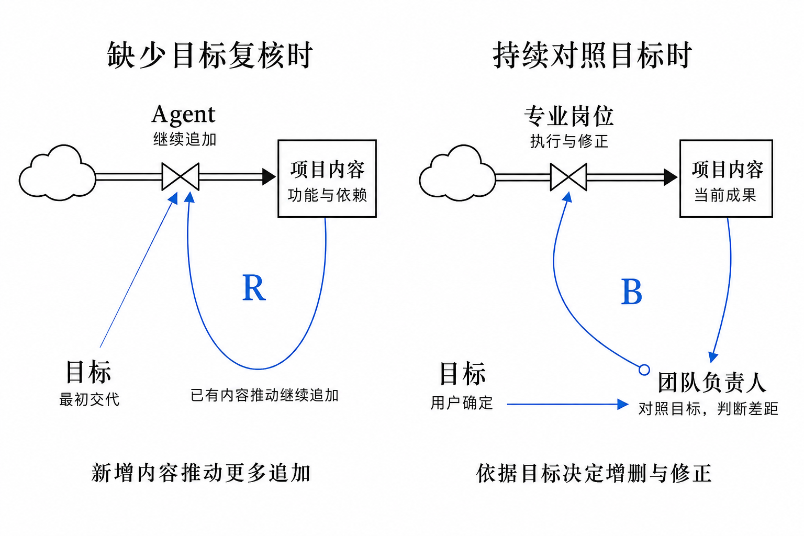
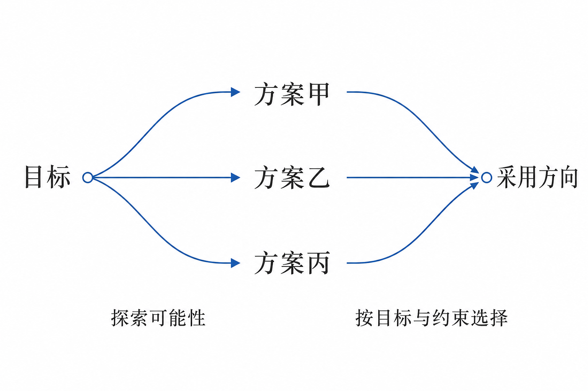
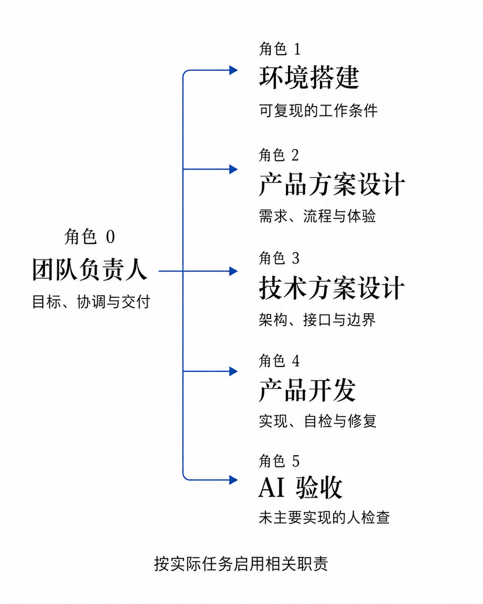
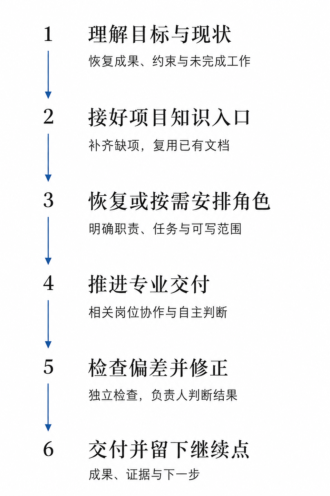
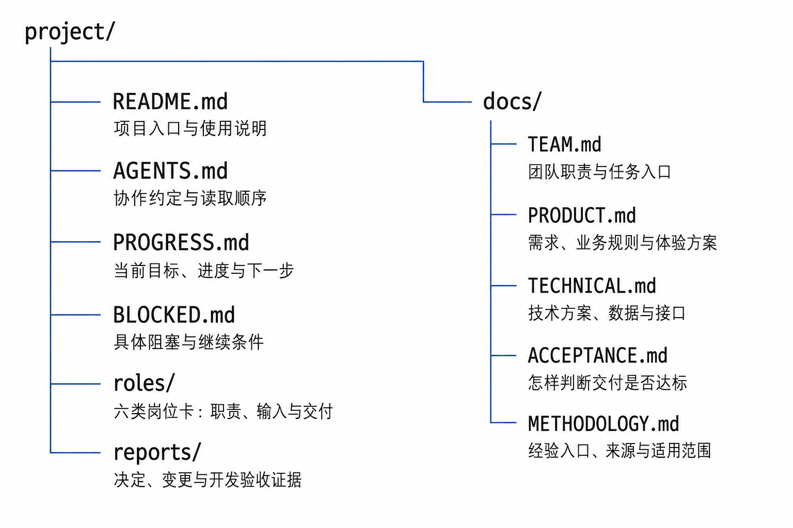

# 给 AI 项目配一位负责人，带领团队朝正确的方向前进

AI Design 996 · 项目介绍 · 2026-09-07 · 首次公开发布 0.5.16

[English](ARTICLE.en.md) · [繁體中文](ARTICLE.zh-Hant.md) · 简体中文 · [分享使用场景与建议](FEEDBACK.md)

**Team Leader：通过专业分工、成果检查与及时纠偏，持续对照使用者的目标推进项目。**

用 AI 做项目，交代任务之后，使用者往往还要记着目标、在不同任务之间传递信息、检查结果，再提醒下一步。项目持续得越久，这些协调工作就越容易占据注意力。我想把其中能交给 AI 的部分，交给一位职责明确的团队负责人。

因此，我设计了 **Team Leader**：一个面向持续项目开发的协作 Skill。这里的负责人也是 AI 角色，Skill 用一套职责、协作方法与项目模板说明它怎样带队。它依据用户目标安排产品、技术、开发与验收等专业工作，检查实际成果，并在发现偏差后组织修正；已经确认的需求、决定、进度和经验，则保存在可查找的项目文件中。

**当前主要设计与验证对象是 GPT-6 Astra。** Sol 已有部分专业岗位的实践记录；模型选择依据与尚未验证的范围见[模型适用性](#model-fit)。

用一句日常的话说，就是让它“带着团队干活，也盯着有没有朝目标前进”。我希望借此减少使用者反复提醒、转述上下文和协调任务的负担。

这套方法主要面向跨多个阶段、需要持续迭代的项目，例如从产品方案、技术设计一路做到开发和验证。职责拆分也会带来沟通与检查成本，简单的一次性任务可以保持简单。后文会分别介绍设计原理、具体分工、使用方法，以及我希望大家怎样参与改进。

**使用前也请留意额度投入：** 多岗位推理、负责人检查和返修可能带来较大的消耗。我已经在方法中加入分配推理级别、整理上下文和减少重复工作的策略，具体见[额度消耗与优化](#usage-cost)。

## 为什么我从反馈回路设计负责人

随着上下文变长、方案反复修改、工作交给不同角色，中间的假设和临时选择容易被沿用。内容一直在增加，但最初要解决的问题可能逐渐被放到一边。我的设计重点，是让“重新对照目标”成为有人持续负责的工作。

阅读 Donella Meadows 的《系统之美》（*Thinking in Systems: A Primer*）后，书中关于调节反馈的描述给了我启发：一个调节回路需要目标、对当前状态与目标差距的反馈，以及响应差距的行动。[1][2] 我把这个思路用在 AI 团队协作中，让每轮工作的结果回到负责人的观察与判断，再推动下一轮行动。

### 核心理念：目标、反馈、行动

在 Team Leader 中，这三个功能分别落实为：

- **目标：** 用户说明希望交付什么、解决什么问题，以及需要遵守的约束。
- **反馈：** 负责人查看实际成果和检查证据，对照目标判断还差在哪里。
- **行动：** 相关专业岗位依据这些差距，继续制作、验证或修正。

图中的“项目内容”是当前已经形成的成果，例如方案、代码与验证结果。负责人观察这些成果，与目标比较后，把差距反馈到专业岗位，推动下一轮更新。

*图1　负责人将实际成果与用户目标进行比较，再推动专业岗位行动。B 表示调节回路；矩形表示当前成果，带阀门的双线表示执行与修正，细箭头表示信息关系，云朵表示未展开的来源。[2][3]*

例如，用户希望某个页面让人一眼看懂信息关系。专业角色做出页面后，负责人需要回到实际画面与操作，判断它有没有达到这个目标。如果信息仍然重复、层级不清楚，就把这些差距交回相关角色修订，再查看修订后的结果。

目标是持续核对的参照。确实需要调整目标或作重要取舍时，负责人应把具体选择和影响交给用户，并记录新的决定。调节反馈能否发挥作用，仍取决于观察是否准确、反馈是否及时，以及修正能否落实；增加一个负责人角色本身并不能保证项目稳定。[2]

### 对比：为什么项目可能越做越大

平常使用 Agent 时，往往是先交代任务，再根据做出的内容继续提出修改。如果后续主要沿着已有内容往下扩展，而缺少对原目标的复核，就可能出现这样的循环：**功能越多，衍生的配套需求与依赖越多；这些需求又被继续纳入任务，推动更多功能增加。**

*图2　左侧只在最初交代目标，已有内容推动更多追加，R 表示这种自我放大的关系。右侧把目标持续带入差距判断，再组织修正。左图描述一种可能的范围膨胀机制，并非所有普通工作流都会如此。[2]*

例如，原本只需要一个简单的记录页面，却逐步加上统计面板、筛选配置，再为它们补充更多设置。如果每项衍生需求都被默认接受，工作会越来越多，却未必更接近最初要解决的问题。这是一个说明机制的假设例子。

负责人在这里需要作出判断：这项新增是否服务目标，当前真正的差距是什么，下一步应该补充、删减，还是修正已有内容。**每一轮工作都要能说明它与目标的关系。** 单个 Agent 也可以进行这样的检查；Team Leader 将这件事明确为负责人的持续职责，并把修正交给有关专业岗位。

## 给创造留空间，在关键节点收敛

项目早期通常需要探索：产品可以怎样组织，技术有哪几条路线，界面是否有更好的表达。产品和技术角色应有空间提出不同方案、质疑假设、解释取舍。

负责人需要把握不同阶段的工作方式：需要探索时，让专业角色展开候选并说明差异；准备进入实现时，依据目标与约束组织比较，明确采用哪个方向、为什么采用。涉及重要取舍时交由用户决定，选定的方向成为后续实现与检查的依据。

*图3　探索与收敛。它说明方案设计的工作方式，与图1的调节回路分开表达。*

例如，页面结构尚未确定时，可以先比较不同的信息组织方式；方向确定后，再检查实现是否兑现了这个选择。新证据仍可以推动调整，但需要说明调整的依据。

探索与收敛是这里的工作方式。增强回路则需要具体的自我放大因果关系，不能只凭方案变多或箭头成环来判断。两者分开表达，才能看清负责人是在什么时候鼓励探索、什么时候组织选择。[2]

## 一个负责人，五类专业职责

产品方案、技术设计、开发和验证各自需要处理大量信息。我借鉴团队中的专业分工，为这些工作保留持续负责的角色，由负责人协调它们之间的目标、依赖和交付。模型能力提高之后，这种分工是否仍然值得采用，取决于项目复杂度和协作成本，需要在实际使用中判断。

*图4　默认六类职责，包括负责人。各岗位按实际任务启用；图中的职责关系不表示所有岗位一直同时运行。*

图中的编号是**职责标识，不是执行顺序**。对应关系是：

- **角色0｜团队负责人：** 维护整体目标，安排分工与依赖，查看成果与验收证据，推动纠偏和交付。
- **角色1｜环境搭建：** 准备工具、依赖和运行环境，让项目能够正常运行和验证。
- **角色2｜产品方案设计：** 明确用户需求、业务流程和界面体验，说明要做什么、怎样用。
- **角色3｜技术方案设计：** 明确实现路线、架构、数据与接口，说明怎样做。
- **角色4｜产品开发：** 完成实现、自检与修复。
- **角色5｜独立 AI 验收：** 检查自己未主要实现的成果，判断是否符合约定。

每个角色都有提出更好方案和异议的空间。用户保留目标、重要取舍和最终体验验收；独立 AI 验收为这些判断提供证据。

### 一次页面改版，负责人怎样带队

下面是一个说明工作方式的假设场景：用户希望页面的主要任务更容易找到，同时保留原有业务规则。

1. **把目标转成可检查的要求。** 负责人记录主要任务入口、信息层级和不能改动的业务规则；产品岗位据此形成方案。
2. **安排有关岗位完成工作。** 技术岗位核对实现影响，开发岗位落实方案；环境问题影响运行时，由环境搭建岗位处理。
3. **查看实际结果，判断差距。** 独立 AI 验收检查约定的行为，负责人结合页面与证据判断目标是否达到。若仍有重复入口或层级问题，就交回相关岗位修正。
4. **修后复查，留下接续点。** 查看最终修改是否解决原问题，记录采用的决定、尚未解决的事项和下一步。

这体现了我所说的“盯着干活”：负责人要关心实际产出和它与目标的差距。能够在现有授权内处理的工作继续推进；确实需要用户判断时，带回具体问题、推荐和影响，减少使用者在多个角色之间逐一追问。

## 让目标、决定和经验能接着用

负责人需要持续对照目标，就必须能找回已经确认的目标与决定。因此，我把项目知识的保存和读取也纳入了这套方法：需求为什么这样定，方案为什么这样选，上一轮做到哪里，哪些问题还没有解决，都应有可查找的位置。

用户反馈里既可能有明确需求，也可能有局部偏好或可复用的经验。负责人结合上下文核对来源、原因与适用范围，再放入相应记录。下一次相关工作开始时，先读取有效决定，完成后再用实际结果修订。

*图5　项目知识的沉淀与复用。记录保存下来之后，还需要在下一次相关工作中主动读取和应用。*

例如，“这个项目的进度卡需要就近显示计数”可以成为项目内有效的体验决定；它不会自动变成所有项目都采用同一种布局的要求。后来的反馈如果改变了这个决定，也应保留变更原因，并明确哪一条现在有效。

这套“记忆”主要依靠可检索的项目记录。需求和方案有自己的文档，进度有当前入口，经验从 `docs/METHODOLOGY.md` 查找。记录的价值，要通过后续任务实际读取、应用和修订来体现；保存文件本身不保证自动记住，也不等于重新训练模型。

## 安装以后，像和负责人说话一样使用

**我的日常用法很简单：先让它接手，再把想法交代给它。** 在已经安装并能识别这个 Skill 的工具中，打开项目对话，选择 Team Leader，或在消息里写上 `$team-leader`。项目已经有资料时，让它先了解现状；新项目则先说你想做什么。

### 第一句话：这个项目由你负责

我在几个实际项目中，开场说的就是“我想让你来接手这个项目”，或“你先了解下这个项目情况，然后说说你的看法”。下面是一种可以直接使用的说法：

> $team-leader 接下来这个项目由你负责。你先了解一下项目现在的情况，再跟我说说你的看法和下一步怎么安排。

如果希望采用团队模式，可以再补一句：“请为这个项目建立完整团队，由你负责协调。”在 0.5.16 中，决定采用团队模式且有创建授权后，一次补齐六类岗位，之后每轮只调动需要的岗位；已有团队则复用原来的角色和分工。实际创建仍需所用工具支持，简单的一次性任务可以保持单人。

这不是必须逐字照抄的口令。你不需要先准备完整的产品文档，也不用自己写出每个岗位的任务书；先说清想做的事，细节可以在沟通中逐步补充。例如：“我想做一个分享 AI 实践的网站，中英文都能看，也方便读者反馈。你来负责跟进，先帮我把这个想法理清楚。”

### 首次使用与项目接手

首次使用不需要另填一个“初始化版本”。你主要做好安装、确认项目位置和运行偏好，版本核对与资料接续由负责人处理。

**先放好完整技能包。** 拿到发布包后，保留整个 `team-leader` 文件夹及内部相对路径。希望在多个项目中使用，就放到个人技能目录 `~/.agents/skills/team-leader/`；只供某个项目使用，则放到该项目的 `.agents/skills/team-leader/`。这两种位置对应 Codex 的个人技能与项目技能范围。[6]

在 Windows 上，个人安装后应能找到 `%USERPROFILE%\.agents\skills\team-leader\SKILL.md`，其中 `%USERPROFILE%` 表示你的用户目录。不要多套一层同名文件夹，也不要只复制 `SKILL.md`；首发 0.5.16 包含 21 个 Skill 文件和 1 个 MIT 许可证，共 22 个文件。安装后在项目的新对话中选择或点名 `$team-leader`，先确认它能读取技能，再用前面的接手语句开始。

[下载 Team Leader 0.5.16](https://github.com/aidesign996/ai-practice/releases/download/team-leader-v0.5.16/team-leader-0.5.16.zip) · [安装说明、校验文件与版本记录](https://github.com/aidesign996/ai-practice/releases/tag/team-leader-v0.5.16)

接手时，把下面三件事对齐即可：

- **选定项目。** 在要工作的项目文件夹中开始对话，把现有资料或已有目标指给它；新项目就说明想做什么。负责人先核对实际目录、已有成果和有效约定，再整理需要的入口，避免重复建立已有文件或团队。
- **选定负责人的模型与推理级别。** 如果希望采用本文主要实践的配置，可以在所用工具中选择 Astra，并以 `xhigh` 作为负责人起点。安装 Skill 本身不会替你切换模型或档位。专业岗位需要自动分配投入时，再把允许使用的模型、档位和预算范围交代给负责人；具体策略见[额度与优化](#usage-cost)。
- **让负责人核对版本。** 负责人读取实际安装版本，再核对这个项目已采用的版本，将本次实际接续情况记在项目总览。你不需要手改版本号，也不需要提前手工搭好整套文档框架；负责人会复用已有资料、补齐必要入口。

这里的“安装版本”指工具读取的技能包，“项目采用版本”指已经落实到这个项目的规则、资料入口和相关岗位。两者可能暂时不同；是否接续完成，要看实际变化是否已经生效。

以后安装了更新包，也可以直接说：“请把这个项目接续到当前安装的 Team Leader 版本，保留已有成果、分工和未完成工作，完成后继续原目标。”负责人核对变化、处理受影响的部分，再接着推进工作。这些信息在首次接手或发生变化时对齐，不需要每轮重新设置。

### 后面就像平常交代工作一样

在同一个项目对话里，继续对这位负责人说话即可，不必每轮重写整套协作方法。下面这些都是围绕实际使用方式整理的例句：

- **说想法：** “我希望这个页面更容易看懂。先给我几个方案，我选一个后再细化。”
- **看进展：** “现在做到哪里了？接下来准备怎么安排？”
- **给反馈：** “这张图太大了，信息很分散。我希望一眼能看完，文字也要清楚。”
- **继续推进：** “这个方向可以，按刚才确定的方案继续完成。”

你的主要工作是说目标、提出偏好、反馈实际感受，并决定重要取舍。负责人负责把这些话落实到需求、分工、成果检查和修正中，减少你在产品、技术、开发等岗位之间反复转述。只想讨论时可以直接说“先讨论，暂时不要改”；决定推进时，再明确让它继续做。

### 负责人接下来会做什么

接手后，它先理解你要交付什么、现在已经做到哪里，再整理有效资料的入口、接续或安排相关职责，推进工作与检查，并留下下一轮可以继续的位置。图中的这些工作是负责人需要组织的内容，你可以从上面的一句日常交代开始。

*图6　接入方法后需要形成的主要结果。实际顺序按依赖安排；已有项目优先复用成果、记录和角色。*

使用时，可以观察负责人是否接上原目标、是否把偏差变成了修正行动，以及下一轮是否还需要你重复解释已经确认的内容。如果它只回复了计划却没有继续，或者仍让你反复提醒，这同样是有价值的使用反馈。

### 主要面向 Astra：换成 Sol 需要注意什么

Team Leader 面向需要处理长任务、多工具和专业协作的模型，目前主要围绕 **GPT-6 Astra** 设计和验证。我希望把目标、约束和验收依据交代清楚，再给负责人组织判断的空间，让专业岗位自行选择合适的方法并完成迭代。这是这套 Skill 的设计取向。

**官方说明中的差异。** OpenAI 指出 Astra 在长任务中比 Sol 更能保持连贯，同时也更容易澄清问题、更敏感地遵循 Skill 指令；委派可能偏少，检查可能超出任务所需，因此应明确自主推进、分工和验证的要求。[4]

所以，我想减少的是不必要的流程束缚：把过时的局部要求当成永久规则、让每个小步骤都等待确认，或为简单修改套上完整流程。有效的目标、权限和质量要求仍需要保留。“给模型更多专业空间”是我们的组织方式，不能概括成“Astra 本身受到的限制更少”。

**Sol 已有部分岗位的实际使用记录。** 官方将 GPT-5.6 Sol 定位为面向复杂专业工作的模型，并列出工具调用和 Skills 支持。[5] 技能维护负责人也提供了两项实践，我与相应项目记录作了核对：

- 一项界面原型任务使用 0.5.11。Sol/high 产品岗位梳理关系视图的含义，Astra/high 开发岗位据此实现，另一个 Astra/high 岗位在浏览器检查交互和窄屏表现。这次交付只覆盖该原型。
- 一项图稿修订使用 0.5.14。Sol/high 产品岗位接续用户标注，交付三处修订，再由负责人和独立验收核查。图片来自单独的生成工具，不能把成图质量全部归于 Sol。

这些记录支持 Sol 曾在混合团队中承担具体职责。目前没有全 Astra 团队与全 Sol 团队在同一任务、输入、质量标准和投入条件下的对照，不能断言 Sol 一定效果差，也不能承诺两者表现相同。

**实践给我的提醒，是把判断落实到成果。** 维护方还追查过一次视觉交付偏差：Astra/xhigh 的负责人和实施者都看过原图，整体差异仍由用户指出。因此，我更重视把完整问题交给专业岗位、让负责人亲看修后的实际成果，再由独立验收核对目标。这个方法判断有具体事件支持，但还没有模型间的效果对照；高档位本身不能代替实际把关。

如果希望尽量贴近本文的设计与已核对经验，建议优先使用 Astra。若使用 Sol，可以从范围可控的任务开始，观察它能否持续接续目标、落实专业分工、依据证据纠偏，以及最终质量、返工和总消耗。反馈时附上模型名称、推理级别和具体场景，会比单纯评价“哪个更聪明”更有助于改进。Skill 的效果还取决于所用工具提供的能力、上下文和任务难度。

### 额度消耗与优化：给判断留余度，减少重复投入

Team Leader 会增加负责人协调、专业岗位执行、独立检查以及必要返修等工作。相比一次简单的单 Agent 请求，这种方式可能消耗更多额度，也可能需要更长时间。是否值得，要结合最终成果和包括返工在内的总投入判断。目前还没有同条件的整体消耗对照，不能给出固定节省比例。

**负责人和专业岗位采用不同的推理投入。** 目前这套自动分配方案主要面向 Astra，并在使用者已经同意的模型、推理级别与预算范围内执行。负责人通常以 `xhigh` 作为默认起点，为全局判断、依赖协调与纠偏保留余度；专业岗位则由负责人按具体任务的复杂度和出错影响安排：

- 输入明确的清单整理、成熟检查或小改动，通常从 `medium` 开始。
- 实质性的产品或技术设计、一般开发、独立验收判断，按复杂度采用 `high`。
- 困难设计、跨系统约束、复杂排错或证据冲突，可以直接采用 `xhigh`，不必先用较低档失败一次。

特定难题确实值得追加投入时，可在授权与工具支持范围内考虑更高档位，例如 `max`；不默认让所有岗位使用最高档。使用者明确选择的模型与推理级别优先。这些是任务分配策略，实际设置需由所用工具支持并核实；不能把一段文字指令当成已经改变了运行设置，也不意味着负责人能自行修改当前正在运行这一轮的级别。

**专业岗位开工前，先判断哪些上下文真正需要携带。** 派工时优先传递当前目标、有效约束、本轮变化和必要证据，其余历史保留可追溯入口。阶段结束、交接、方向变化，或旧信息已经干扰判断时，由负责人组织一份精简的有效状态说明，保留已完成成果、未完成工作、当前分工、重要经验和下一步，图片等关键原件仍可直接查看。

这里采用的是有条件的整理与压缩，不是每次开工都清空历史或重建任务。只有工具确实提供合适的上下文压缩能力时，才在不打断在途工作的边界使用，并检查目标和约束是否接续。写了摘要本身并不会缩短活动会话；压缩、重新读取也有成本，不能预设一定更省。

目前尚未验证负责人能自动压缩各岗位会话；已确认的优化重点是整理有效信息、复用记录与减少重复输入。

**减少重复工作，并在扩大投入前看额度。** 复用仍有效的调查和检查结果，筛选必要的工具输出，避免负责人重复执行开发自检和独立验收的全部工作，也避免反复询问没有变化的状态。新任务或投入明显扩大前，在工具支持时检查共享账户的剩余额度；明显不足时说明现状和可选安排。既有授权内的工作正常推进，不把成本意识变成每一步都等用户确认。

这些分配与上下文管理规则已写入核对过的 0.5.13 协议，并在首发 0.5.16 源码中保留。规则存在、运行设置实际生效、最终节省多少，是需要分别核实的三件事。我会保留足够的判断和验证投入，也欢迎大家反馈哪些环节消耗较大、产生了什么价值，以及哪里可以减少重复。

## 文件框架：每类信息有可找到的位置

文件框架服务于团队接续工作。新项目可以从随包模板开始，已有项目则复用有效资料，补齐缺少的入口。不同职责找到自己的依据后，才能围绕同一组目标与决定协作。

*图7　当前模板提供的项目知识框架。文件结构示意不代表文档已经填完，也不代表项目已经完成。*

可以按日常工作中的问题来理解这些文件：

- **项目是什么、接下来做什么：** `README.md` 提供总览；`PROGRESS.md` 记录当前进度与下一步；`BLOCKED.md` 记录尚未解决的阻塞。
- **怎样协作、由谁负责：** `AGENTS.md` 说明项目约定与读取路线；`docs/TEAM.md` 与 `roles/` 保存分工和角色相关资料。
- **做什么、怎样做、怎样算完成：** 分别从 `docs/PRODUCT.md`、`docs/TECHNICAL.md`、`docs/ACCEPTANCE.md` 查找产品、技术和验收约定。
- **为什么作这个决定、验证到了什么：** `reports/` 保留过程与检查依据，`docs/METHODOLOGY.md` 提供经验的读取入口。

这些是项目工作资料。Skill 的安装包则包含 `SKILL.md`、方法参考和模板，应保留完整包及相对路径；其中的 `agents/openai.yaml` 是界面配置，与项目的 `AGENTS.md` 用途不同。

### 后续迭代：给持续修改的成果保留版本

在 **0.5.15** 中，我补充了成果版本管理的规则：负责人在接手项目或工作发生实质变化时，判断代码、脚本、持续修订的文档和设计稿是否留有可比较、可恢复的版本。已有有效机制就继续使用；确实需要却缺失时，在授权内组织补齐，并核实重要文件已经进入实际版本记录。这样，后续修改才有可对照、可取回的依据。普通一次性任务不强制使用 Git。

这项增量已通过结构检查、独立文本审阅和本机安装一致性核对。**仅靠技能更新，能否让负责人在真实项目中自主发现并纠正这类遗漏，仍待验证。** 本地版本管理也不等于已经公开到 GitHub，或已经做好异地备份与线上回滚。

### 0.5.16：完整建队，按需调动

首发版进一步区分“是否需要团队”和“本轮需要哪些岗位”：采用团队模式并具备授权后，一次补齐完整六岗架构，复用已有角色，之后按任务调动有关岗位。工作范围变化时，负责人也需要重新判断当前安排是否足够。小任务仍可单人完成，用户限制和实际工具能力优先。

公开包已通过技能基础结构、相对引用、22 文件的压缩包与干净目录解压一致性检查；另有四个合成情境的独立规则审阅。这些检查不等于新账号完整实时团队或长期效果验证。

## 进一步的方向：负责人之间怎样协作

当多个项目有关联时，我希望把这种协作进一步延伸到负责人之间：一个负责人提出需要什么资料、解决什么问题，另一位负责人结合自己的项目作出回应，各自继续维护本项目的团队、成果和知识。

*图8　跨项目协作的扩展方向。虚线表示沟通关系，不表示已经提供常驻自动调度服务。*

本次分享准备中，分享负责人向技能维护负责人和实际使用过的项目负责人收集资料，就是一次有具体范围的跨项目沟通。目前它依赖宿主可用的通信工具和实际授权；未来可以进一步完善请求、回执、依赖与反馈的组织方式。

这些交流应传递完成当前任务所需的信息。某个项目中的业务内容、局部偏好或修改权限，不会因为负责人之间可以沟通就自动变成其他项目的共同规则。

## 欢迎把真实工作中的问题带回来

本文设计说明从已核对的 **0.5.13** 整理而来；首次公开包为 **0.5.16**，包含 21 个 Skill 文件及 1 个 MIT 许可证，后续增量在相应段落单独说明。主要设计与验证对象为 GPT-6 Astra，已有实践主要来自 Windows 上的 Codex 桌面应用。Sol 已有混合团队中的部分岗位实践，尚无全 Sol 团队的同条件效果对照；其他系统或 Agent 平台也尚未完成同等范围的兼容验证。上述安装路径已与本机实践和官方说明核对，但尚未完成干净机器或新账号从安装到完整团队交付的全流程验证。

**Team Leader 0.5.16 以 MIT 许可证公开，欢迎试用。** [版本页面](https://github.com/aidesign996/ai-practice/releases/tag/team-leader-v0.5.16)提供完整安装包、说明与文件校验清单。可以先从目标清楚、范围可控的小项目试用，再判断它是否适合更复杂的工作。

**欢迎试用后带着真实工作中的问题来交流，也欢迎现在就讨论设计与适用场景。** 我会结合大家的反馈继续优化这套 Skill。网页文章下方就是评论区，用英文、繁体中文或简体中文直接写就好，不用分栏填写，也不用先分析技术原因。

可以聊聊当时想做什么、实际发生了什么、怎样会更好；知道多少就写多少，有用的体验同样欢迎分享。后续的整理、场景核对和改进分析，由我和技能维护负责人跟进。

例如：“我让负责人继续修改页面，它只回复了计划，没有继续做。我还得追问一次。希望它能在已有授权内继续完成；确实需要我决定时，再说明具体卡在哪里。”这是反馈表达的示例，无需整理成技术报告。

[到文章下方看留言、分享你的使用场景](FEEDBACK.md)

你可以在文章下方查看留言、发表评论和回复，三种语言共用同一个讨论区。首次留言需要登录 GitHub 并授权评论组件 giscus，之后可以在文章内继续交流。点击发布后，留言会公开保存到分享仓库的 GitHub Discussions，其他人也能阅读和补充经历。版本、使用工具和已去除私人信息的截图有助于理解，但可以在需要时再补充。

我会先理解场景与原目标，再判断是当前项目的局部需要，还是值得纳入 Skill 的通用改进。确定调整后，回到原场景检查，并说明改了什么、验证到哪里、还有哪些限制。你可以在同一条反馈中继续补充结果；暂时没有解决的问题也应保留，供后续跟进。

我也在改进验证方法：如果要判断新版是否让负责人更主动，后续会在完成修订、必要检查与安装后，让负责人读取新版，不预先点明待观察的具体遗漏，再观察它是否自行发现适用的问题、组织修正并检查结果。“明确指出问题后完成修复”和“自主发现并纠偏”会分别评价。这是后续维护的验证方法；本轮版本管理增量的后一项效果尚未验证。

我最希望从这些反馈中了解的是：负责人在哪些时候帮你接住了工作，又在哪些时候仍需要你反复提醒。让它更好地带领团队围绕目标推进，是我会持续实践和改进的方向。

## 参考与图示说明

1. Donella H. Meadows，*Thinking in Systems: A Primer*，Diana Wright 编辑，2008。[出版社介绍](https://chelseagreen.co.uk/book/thinking-in-systems/)。
2. Donella Meadows，[Leverage Points: Places to Intervene in a System](https://donellameadows.org/archives/leverage-points-places-to-intervene-in-a-system/)，其中关于增强反馈、调节反馈、目标、监测与响应机制的论述。
3. 原书第36页图15的图示形式参考：[英文节选，第35—72页](https://www.gc.soton.ac.uk/files/2015/01/Thinking-in-Systems35-72.pdf)。
4. OpenAI，[GPT-6 Astra 使用与提示指南](https://developers.openai.com/api/docs/guides/latest-model)，尤其长任务连贯性、指令敏感性、委派和验证的说明，核对日期：2026-09-07。
5. OpenAI，[GPT-5.6 Sol 模型说明](https://developers.openai.com/api/docs/models/gpt-5.6-sol)，核对日期：2026-09-07。模型能力说明与本 Skill 的兼容验证是不同依据。
6. OpenAI，[Codex 自定义：技能](https://learn.chatgpt.com/zh-Hans/docs/customization/overview#技能)，个人与项目技能目录、技能组成及调用方式，核对日期：2026-09-07。

本文八张配图为结合 Team Leader 内容设计的概念示意，经 imagegen 制作或优化，并核对文字与关系。图1和图2借用原书的存量、流量与信息反馈符号，解释用户目标、负责人判断和专业岗位行动之间的关系；流线概括内容的追加或更新，未建立可计算的存量与变化速率模型。其余图解释本项目的设计。配图是本文示意，不是原书原图、运行截图或效果证据。主体文件与行为说明以已核对的 0.5.13 源包为依据，后续增量及其验证范围另行标明，英文、繁体中文与简体中文版本表达同一内容。
