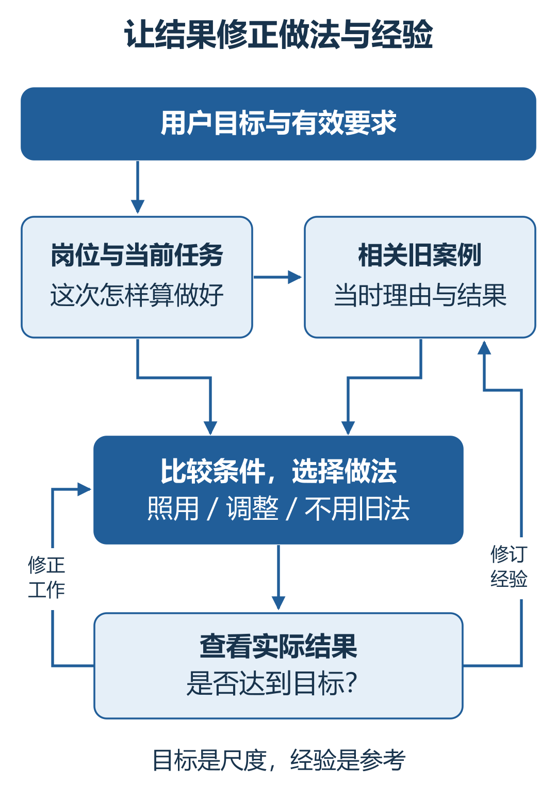
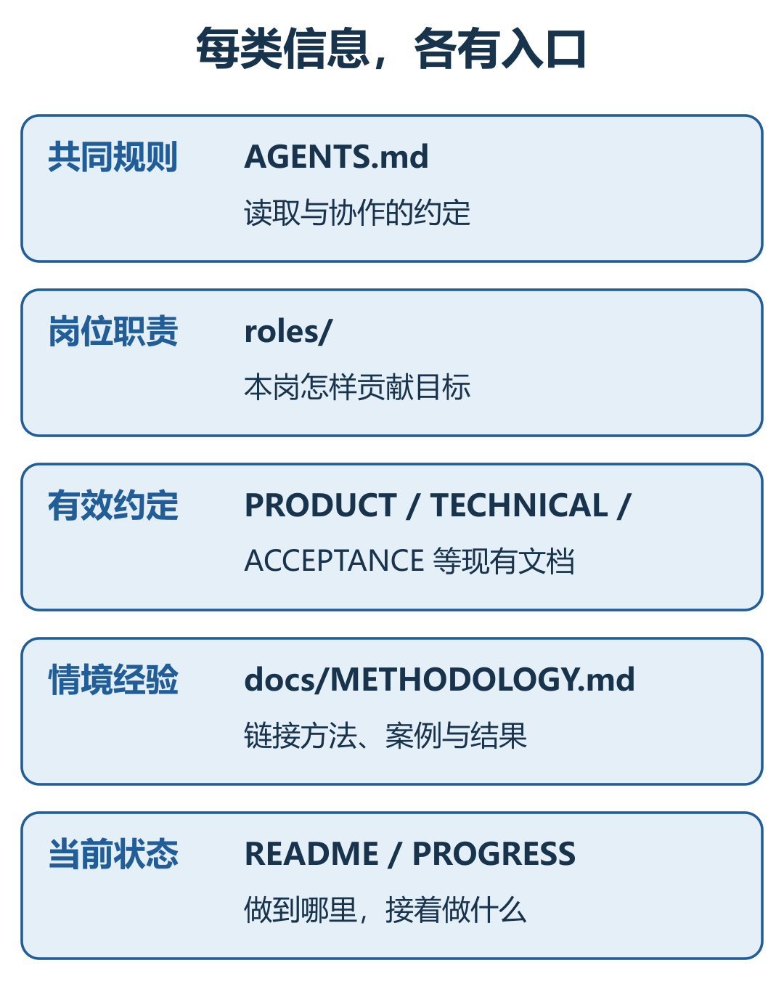

# Team Leader：AI 团队如何协作、纠偏与积累经验

AI Design 996 · 设计与实践 · 2026-09-11 修订 · 首次公开发布 2026-09-07

[English](ARTICLE.en.md) · [繁體中文](ARTICLE.zh-Hant.md) · 简体中文 · [分享使用场景与建议](FEEDBACK.md)

**Team Leader 是一套以 Skill 为载体的 AI 团队工作方法：围绕用户目标组织专业工作，通过反馈修正成果，并把实践经验带入下一次判断。**

本文从产品目标和系统思考出发，说明职责分工、跨项目协作与经验学习如何连接、如何实现，再用一次真实的分享实践展示运行过程，最后讨论成本、局限和改进方向。

## 产品目标：让负责人接住完整的工作

使用 AI 做项目，用户常常同时承担三种工作：盯着进度与方向，在不同项目之间转述问题，以及反复解释已经说过的要求。每一步都能完成，整件事却仍依赖用户不断接手。

Team Leader 希望把这些持续的责任交给 AI 负责人。用户提出目标、决定重要取舍；负责人理解目标，组织实施与检查，主动联系需要配合的专业负责人，再根据实际结果改进工作。

这套设计包含三个相互连接的部分：

| 组成 | 要解决的问题 | 主要机制 |
| --- | --- | --- |
| 目标、职责与交付 | 怎样持续把事情做对？ | 明确岗位贡献，对照成果找差距，组织修正 |
| 专业分工与跨项目协作 | 谁来做，缺少的专业能力怎样接上？ | 项目内分工，负责人之间直接交流与衔接 |
| 经验沉淀与再次应用 | 这次学到的，下次怎样真正用上？ | 保存条件和理由，按情境检索，比较后使用，以结果修订 |

三者共同服务于一个产品目标：**让用户更少反复提醒、来回传话和从头教，让负责人更能承担工作，也更懂得怎样与你配合。**

目前主要围绕 Codex 中的 Astra 设计与实践。`SKILL.md` 提供入口，`references/protocol.md` 规定协作、交付与知识使用方式，随包模板承接项目中的职责、要求和记录。实际执行、文件访问和任务间通信，由所在应用提供。模型发挥理解、判断与创造能力，机制是否有效则由成果检验。

## 理论依据：用调节把握方向，让积累改善判断

《系统之美》中的反馈思想，是这套设计的重要来源。调节回路与增强回路描述两种不同的作用：前者通过反馈缩小与目标的差距，后者使已有变化继续加强。它们的含义可参见 Meadows 对[反馈回路的原始论述](https://donellameadows.org/archives/leverage-points-places-to-intervene-in-a-system/)。

### 调节回路：目标、反馈与行动相互连接

放到 AI 工作中，用户目标是判断尺度，项目成果是当前状态，专业岗位负责执行与修正。负责人查看实际成果，识别差距，再协调下一轮行动；行动后的结果继续反馈回来。

*图1　B 表示调节回路。目标持续参与判断，执行后的成果再成为反馈。*

负责人需要看到真实成果。例如网页是否好用，要查看页面和操作；文章是否清楚，要读整篇、看配图。完成报告、文件数量和检查次数，都只是支持判断的材料。

**调节能否起作用，取决于差距是否找准、修改是否落实，以及修改后的结果是否被再次检查。**

### 增强回路：让有效经验支持后续工作

我们希望形成这样的积累：实际工作产生可借鉴的经验，经验改善下一次判断，新的实践又带来更丰富的经验。前期探索也可以借助已有理解，提出和比较更多有价值的可能。

但积累需要筛选与修正。错误解释、过时要求和重复材料也可能被不断强化。因此，探索与经验积累始终要接受目标和真实结果的检验。这里是将反馈思想用于工作方法的设计，还没有建立可计算的系统动力学模型，也不能据此推断能力会持续自动增长。

*图2　R 表示增强回路：已有经验帮助提炼与验证，新形成的有效经验再充实积累。*

## 机制一：明确职责，连接探索、实现与检查

**用户决定目标与核心取舍，负责人承担组织和交付责任，专业岗位为共同目标贡献成果。**

负责人先理解“为什么做、怎样算做好”，再判断需要哪些专业工作。各岗位获得明确的任务、必要资料和成果要求，同时保留提出问题、比较方案和选择实现方法的空间。

### 先探索，再把已选方向准确实现

产品尚未想清楚时，需要比较不同方案；技术存在分歧时，需要说明适用条件、代价和风险。重要方向由用户决定，已授权的普通实现选择由负责人和相关岗位推进。

*图3　这一图只解释探索与选择：先打开可能性，再把选择接到实现上。*

方向确定后，开发要兑现已经确认的设计；成果不符合要求，就返回相关岗位修正。负责人也可以提出异议和更好的建议，但不能自行更换用户目标，或用一个旧案例覆盖有效要求。

### 按专业贡献组织工作

完整团队安排六类职责：负责人统筹目标、协调和交付；环境、产品、技术、开发与独立 AI 验收分别承担专业工作。

*图4　编号表示职责，不要求每一轮都让所有岗位工作。*

简单工作可以由一人完成。需要专业协作时，优先复用已有的合适负责人；确需新团队并获得授权，再建立完整安排，每轮调动与任务有关的岗位。

团队模式下，独立 AI 验收由未主要实现该项成果的角色检查；开发仍承担自己的自检。负责人接回检查结果，判断对整体目标的影响，并组织必要修改。这些职责和衔接方式由 Skill 的协作、交付与验收协议规定。

## 机制二：让项目负责人直接协作

项目内分工解决一项成果怎样由不同专业完成。跨项目协作则把已经存在的专业负责人连接起来，例如分享负责人向 Skill 开发负责人了解设计与使用条件。

**当前负责人继续对最终交付负责，相关负责人承担各自的专业结果。**

实际协作可以分成四步：明确缺少什么资料或成果；找到已有的专业负责人，交代用途和问题；收到回应后核对、追问；把答案用进当前工作并继续交付。

*图5　虚线表示按需沟通。各负责人带着自己的专业判断配合，资料仍有明确归属。*

沟通不只是转发文字。两位负责人可以从不同角度提出意见：一方考虑表达是否容易理解，另一方核对描述是否准确、操作是否可行。分歧需要通过具体问题和证据讨论，再接回共同任务。

实现这套协作，需要应用支持负责人之间通信，并允许访问任务所需的资料。Skill 规定如何组织协作，通信工具完成消息传递；单独放入 Skill 文本不会自动连接其他项目。

## 机制三：经验怎样留下，又怎样参与判断

经验学习包含保存与使用两个环节。岗位原则说明做判断的出发点；具体案例记录当时如何实践这个原则，以及结果怎样。

### 从目标出发检索，从实际结果中修订

接到任务后，负责人先恢复用户目标、岗位职责和有效要求，再查找与当前问题有关的案例。比较旧案例的条件、选择理由与实际结果，决定照用、调整，或不用旧方法。

*图6　两条回程各有用途：修正当前工作，以及修订留给以后使用的经验。*

**借用经验，是借当时的判断依据，再决定这次怎样做。**

例如“让读者容易抓住重点”是目标，加粗和分段是方法。重点被埋住时可以增加少量强调；满页都在强调时，可能需要减少加粗。同一目标，在不同条件下可以导向不同做法。

做完后再看结果：问题仍在，就继续改当前成果；发现了新的适用条件或教训，就补回原案例。用户反馈与 AI 实际尝试都可以成为来源，尚未验证的解释仍应保留为假设。

### 用固定入口保存不同性质的信息

Skill 的项目知识协议约定读取和更新方式，项目文件保存具体内容。入口之间有引用关系，负责人需要按当前问题查找，而不是每次把所有资料都塞进上下文。

*图7　图中是随包模板的知识分工，已有项目可以复用自己的有效入口。*

`AGENTS.md`：共同规则，以及何时读取相关资料。 
`roles/`：各岗位的责任和对整体目标的贡献。 
产品、技术与验收文档：已经确认的要求和决定。 
`docs/METHODOLOGY.md`：经验入口，链接具体方法、案例与结果。 
`README.md`、`PROGRESS.md` 等：当前状态、未完成工作和下一步。

**有效要求按其适用范围执行；可选方法与案例，再判断对当前任务是否有用。**

一次性要求本次照办，无关或重复的内容不必沉淀成经验。经验有新证据时，应修订原记录的条件和解释。这样既保留需要的知识，也避免资料越积越杂。

## 实践：一次 Skill 分享，怎样把机制用起来

这次准备分享文章时，用户交代的目标是：让读者理解这个 Skill，并能开始使用；资料由分享负责人直接找开发负责人沟通。

| 环节 | 实际处理 | 对成果的影响 |
| --- | --- | --- |
| 专业协作 | 分享负责人追问“读者能否照着一句话开始”，开发负责人核对设计和使用条件 | 上手说明补清安装、启用及任务间通信的前提，再给出简单交代方式 |
| 目标反馈 | 用户指出文字密、重点不突出、图文不对应，分享负责人据此调整 | 通过分段、有限加粗和修改图示，逐项回应阅读问题 |
| 经验整理 | 岗位要求与具体改稿案例分别保存，由经验入口关联 | 为后续查找保留目标、处理理由和结果，供下次比较使用 |

这一实践已有直接沟通和改稿记录。它也暴露出局限：部分阅读要求仍曾遗漏，需要用户再次指出才修正。

跨项目取材已经实际发生，经验也已有保存入口；后续是否能稳定主动检索、少提醒，仍需继续观察。上节加粗与分段的比较用于解释判断方法，不是不同排版方案的效果实验。

## 安装后，怎样开始使用

将 [Team Leader 中文项目页](https://github.com/aidesign996/team-leader/blob/main/README.zh-CN.md#start)交给支持联网和项目文件操作的 AI，并说：

> 请按项目说明，从最新正式发行安装完整的 Team Leader Skill，完成后告诉我实际安装的版本。如果已经安装，请先保留项目资料和自定义修改，再帮我更新。

在项目里选用 Team Leader，再交代正在做的事：

> 这件事交给你负责，帮我持续跟进。过程中有用的经验留下来，以后遇到类似事情，先找来看看怎么用。

已有项目先找回目标、成果、现有角色和未完成工作；只有想法时，可以先讨论需求与方向。需要跨项目配合，再告诉它相关项目或负责人。

发布新版不会自动更新本地安装。更新后，让原负责人读取适用变化，保留已确认要求和原工作继续点。具体安装、启用与更新方式以项目页为准。

## 局限与愿景：用真实效果改进这套方法

### 能力与环境的边界

当前实践主要在 Windows 的 Codex 中，围绕 Astra 展开；Sol 有部分专业岗位实践，还没有全 Astra 与全 Sol 团队的同条件对照。

强模型也需要清楚、一致的目标和约束。[OpenAI 的 Astra 指导](https://developers.openai.com/api/docs/guides/latest-model?model=gpt-6-astra)也讨论了指令敏感性、委派和相称验证。增加规定并不自动改善执行，仍要检查实际行为和结果。

这套方法依赖模型按流程工作，以及应用的文件、通信和任务管理能力。经验文件不会重新训练模型，也不能保证所有要求永远被正确检索和执行。

### 更多协作，也意味着更多投入

多岗位沟通、上下文读取、独立检查和返修，可能增加时间与额度消耗。对简单任务，应采用足以完成目标的最小安排。

0.5.23 在用户授权自动分配时，负责人通常以 `high` 为起点，专业工作按复杂度安排投入；用户明确选择的模型与档位优先。必要时提高投入，同时复用仍有效的资料和检查，避免重复验证没有变化的内容。

目前没有可靠的整体省时或额度节省比例。更需要衡量的是：成果是否符合需求，偏差是否减少，用户是否少重复提醒，以及这些改善是否值得相应投入。

### 希望越用越懂你，也越用越会做事

**未来希望积累的是更成熟的判断、更顺畅的协作，以及用户可以信任的交付能力。**

各领域负责人在实际工作中完善经验，需要其他专业时直接配合；用户更少解释基础要求，更多讨论当前目标与成果。“越来越聪明”应体现在理解用意、比较条件和调整方法的实际表现上。

Skill 本身也需要持续改进：维护负责人观察使用问题，找到背后的机制，组织修订、验证与安装，再让使用项目采用并检查效果。修复应落在真正出问题的地方，避免每次偏差都变成一条新规定。

欢迎在[文章下方留言](FEEDBACK.md)，或到 [GitHub 公开讨论](https://github.com/aidesign996/ai-practice/discussions/1)分享体验：你在做什么、它怎样处理、哪里仍要你补一手、你希望怎样会更好。有用的做法和失败的场景，都能帮助我们继续优化这个 Skill。

## 参考与实现入口

- Donella H. Meadows，*Thinking in Systems: A Primer*（《系统之美》）。本文将反馈思想用于 AI 工作方法的设计。
- Donella Meadows，[Leverage Points: Places to Intervene in a System](https://donellameadows.org/archives/leverage-points-places-to-intervene-in-a-system/)，反馈、目标与系统干预的原始论述。
- [Team Leader 项目与安装说明](https://github.com/aidesign996/team-leader/blob/main/README.zh-CN.md)、[正式发行](https://github.com/aidesign996/team-leader/releases/latest)与[更新记录](https://github.com/aidesign996/team-leader/blob/main/CHANGELOG.md)。本文机制说明基于 0.5.23，后续使用请核对当时正式版。
- OpenAI，[GPT-6 Astra 使用指导](https://developers.openai.com/api/docs/guides/latest-model?model=gpt-6-astra)。模型指导与本 Skill 的实践效果分别判断。
