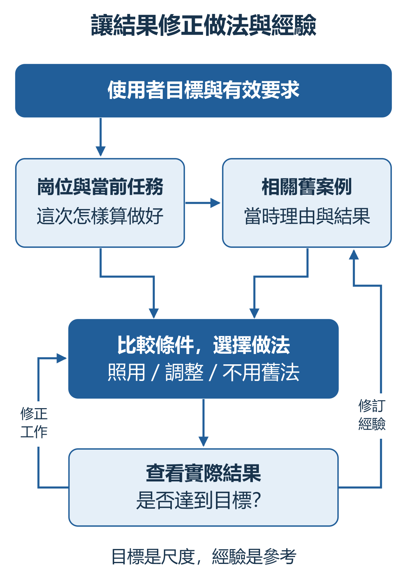
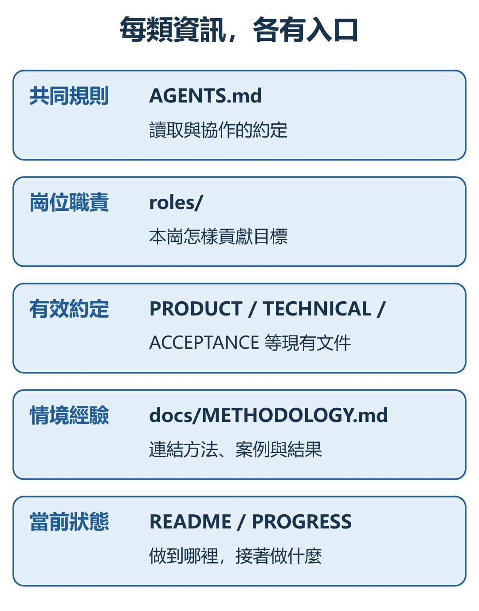
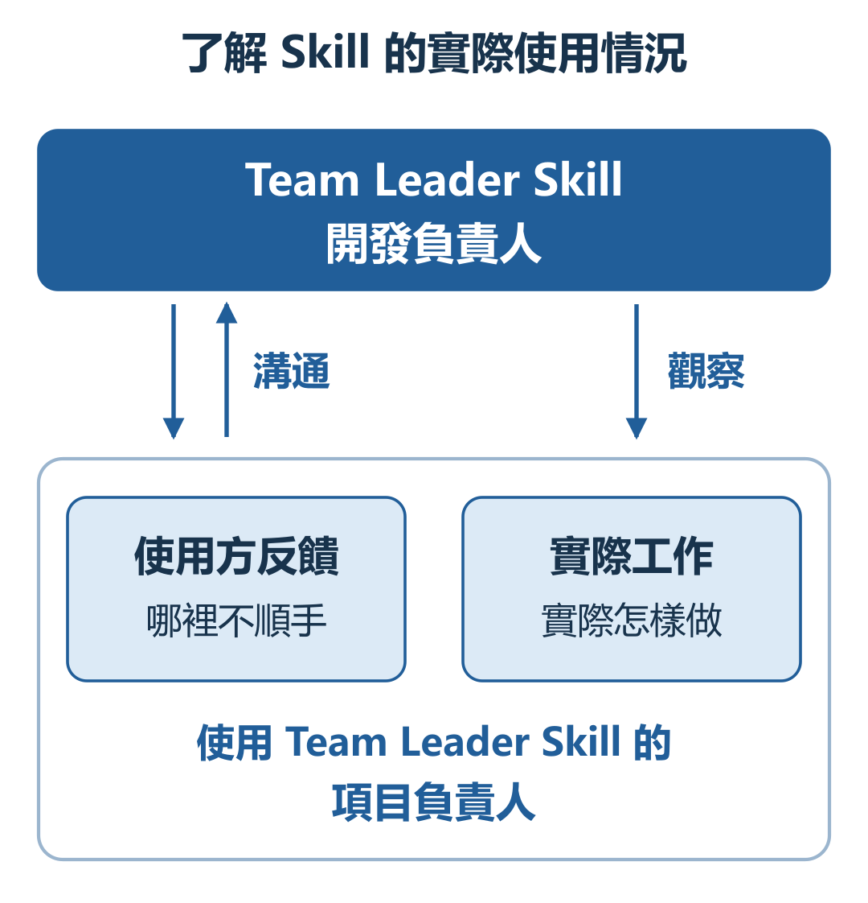
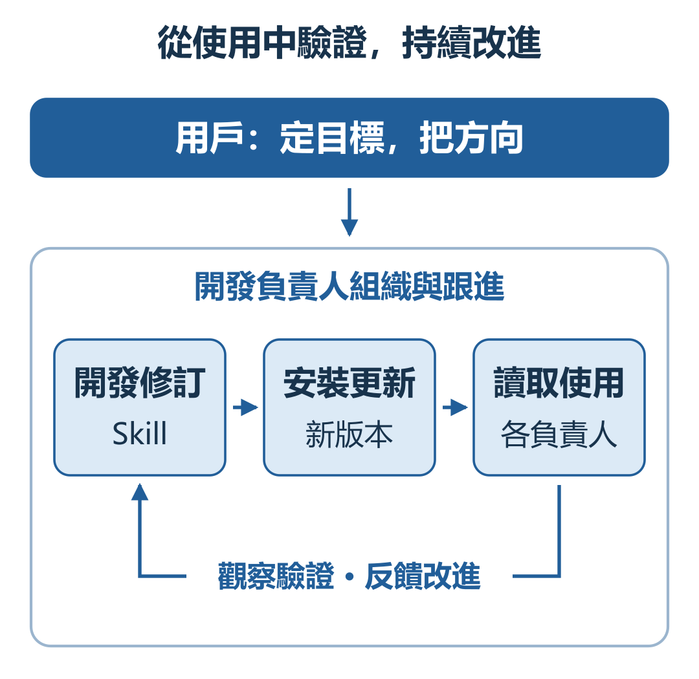

# Team Leader：AI 團隊如何協作、糾偏與積累經驗

AI Design 996 · 設計與實踐 · 2026-09-13 修訂 · 首次公開發布 2026-09-07

[English](ARTICLE.en.md) · 繁體中文 · [简体中文](ARTICLE.md) · [分享使用場景與建議](FEEDBACK.zh-Hant.md)

**Team Leader 是一套以 Skill 為載體的 AI 團隊工作方法：圍繞用戶目標組織專業工作，通過反饋修正成果，把經驗帶入下一次判斷，並由開發負責人跟進實際使用、持續改進這套方法。**

本文從產品目標和系統思考出發，說明職責分工、跨項目協作、經驗學習與方法迭代如何連接、如何實現，再結合分享實踐和使用核查，討論使用方法、成本與侷限。

## 產品目標：讓負責人接住完整的工作

使用 AI 做項目，用戶常常同時承擔三種工作：盯著進度與方向，在不同項目之間轉述問題，以及反覆解釋已經說過的要求。每一步都能完成，整件事卻仍依賴用戶不斷接手。

Team Leader 希望把這些持續的責任交給 AI 負責人。用戶提出目標、決定重要取捨；負責人理解目標，組織實施與檢查，主動聯繫需要配合的專業負責人，再根據實際結果改進工作。

這套設計包含四個相互連接的部分：

| 組成 | 要解決的問題 | 主要機制 |
| --- | --- | --- |
| 目標、職責與交付 | 怎樣持續把事情做對？ | 明確崗位貢獻，對照成果找差距，組織修正 |
| 專業分工與跨項目協作 | 誰來做，缺少的專業能力怎樣接上？ | 項目內分工，負責人之間直接交流與銜接 |
| 經驗沉澱與再次應用 | 這次學到的，下次怎樣真正用上？ | 保存條件和理由，按情境檢索，比較後使用，以結果修訂 |
| 使用監督與方法迭代 | 設計寫進了 Skill，實際有沒有做到？ | 溝通與觀察實際使用，定位差距，組織修訂並驗證採用效果 |

四者共同服務於一個產品目標：**讓用戶更少反覆提醒、來回傳話和逐項檢查，讓負責人更能承擔工作，也能推動做事方法持續改進。**

目前主要圍繞 Codex 中的 Astra 設計與實踐。`SKILL.md` 提供入口，`references/protocol.md` 規定協作、交付與知識使用方式，隨包模板承接項目中的職責、要求和記錄。實際執行、文件訪問和任務間通信，由所在應用提供。模型發揮理解、判斷與創造能力，機制是否有效則由成果檢驗。

## 理論依據：用調節把握方向，讓積累改善判斷

《系統之美》中的反饋思想，是這套設計的重要來源。調節迴路與增強迴路描述兩種不同的作用：前者通過反饋縮小與目標的差距，後者使已有變化繼續加強。它們的含義可參見 Meadows 對[反饋迴路的原始論述](https://donellameadows.org/archives/leverage-points-places-to-intervene-in-a-system/)。

### 調節迴路：目標、反饋與行動相互連接

放到 AI 工作中，用戶目標是判斷尺度，項目成果是當前狀態，專業崗位負責執行與修正。負責人查看實際成果，識別差距，再協調下一輪行動；行動後的結果繼續反饋回來。

*圖1　B 表示調節迴路。目標持續參與判斷，執行後的成果再成為反饋。*

負責人需要看到真實成果。例如網頁是否好用，要查看頁面和操作；文章是否清楚，要讀整篇、看配圖。完成報告、文件數量和檢查次數，都只是支持判斷的材料。

**調節能否起作用，取決於差距是否找準、修改是否落實，以及修改後的結果是否被再次檢查。**

### 增強迴路：讓有效經驗支持後續工作

我們希望形成這樣的積累：實際工作產生可借鑑的經驗，經驗改善下一次判斷，新的實踐又帶來更豐富的經驗。前期探索也可以藉助已有理解，提出和比較更多有價值的可能。

但積累需要篩選與修正。錯誤解釋、過時要求和重複材料也可能被不斷強化。因此，探索與經驗積累始終要接受目標和真實結果的檢驗。這裡是將反饋思想用於工作方法的設計，還沒有建立可計算的系統動力學模型，也不能據此推斷能力會持續自動增長。

*圖2　R 表示增強迴路：已有經驗幫助提煉與驗證，新形成的有效經驗再充實積累。*

## 機制一：明確職責，連接探索、實現與檢查

**用戶決定目標與核心取捨，負責人承擔組織和交付責任，專業崗位為共同目標貢獻成果。**

負責人先理解“為什麼做、怎樣算做好”，再判斷需要哪些專業工作。各崗位獲得明確的任務、必要資料和成果要求，同時保留提出問題、比較方案和選擇實現方法的空間。

### 先探索，再把已選方向準確實現

產品尚未想清楚時，需要比較不同方案；技術存在分歧時，需要說明適用條件、代價和風險。重要方向由用戶決定，已授權的普通實現選擇由負責人和相關崗位推進。

*圖3　這一圖只解釋探索與選擇：先打開可能性，再把選擇接到實現上。*

方向確定後，開發要兌現已經確認的設計；成果不符合要求，就返回相關崗位修正。負責人也可以提出異議和更好的建議，但不能自行更換用戶目標，或用一箇舊案例覆蓋有效要求。

### 按專業貢獻組織工作

完整團隊安排六類職責：負責人統籌目標、協調和交付；環境、產品、技術、開發與獨立 AI 驗收分別承擔專業工作。

*圖4　編號表示職責，不要求每一輪都讓所有崗位工作。*

簡單工作可以由一人完成。需要專業協作時，優先複用已有的合適負責人；確需新團隊並獲得授權，再建立完整安排，每輪調動與任務有關的崗位。

團隊模式下，獨立 AI 驗收由未主要實現該項成果的角色檢查；開發仍承擔自己的自檢。負責人接回檢查結果，判斷對整體目標的影響，並組織必要修改。這些職責和銜接方式由 Skill 的協作、交付與驗收協議規定。

## 機制二：讓項目負責人直接協作

項目內分工解決一項成果怎樣由不同專業完成。跨項目協作則把已經存在的專業負責人連接起來，例如分享負責人向 Skill 開發負責人瞭解設計與使用條件。

**當前負責人繼續對最終交付負責，相關負責人承擔各自的專業結果。**

實際協作可以分成四步：明確缺少什麼資料或成果；找到已有的專業負責人，交代用途和問題；收到回應後核對、追問；把答案用進當前工作並繼續交付。

*圖5　虛線表示按需溝通。各負責人帶著自己的專業判斷配合，資料仍有明確歸屬。*

溝通不只是轉發文字。兩位負責人可以從不同角度提出意見：一方考慮表達是否容易理解，另一方核對描述是否準確、操作是否可行。分歧需要通過具體問題和證據討論，再接回共同任務。

實現這套協作，需要應用支持負責人之間通信，並允許訪問任務所需的資料。Skill 規定如何組織協作，通信工具完成消息傳遞；單獨放入 Skill 文本不會自動連接其他項目。

## 機制三：經驗怎樣留下，又怎樣參與判斷

經驗學習包含保存與使用兩個環節。崗位原則說明做判斷的出發點；具體案例記錄當時如何實踐這個原則，以及結果怎樣。

### 從目標出發檢索，從實際結果中修訂

接到任務後，負責人先恢復用戶目標、崗位職責和有效要求，再查找與當前問題有關的案例。比較舊案例的條件、選擇理由與實際結果，決定照用、調整，或不用舊方法。

*圖6　兩條回程各有用途：修正當前工作，以及修訂留給以後使用的經驗。*

**借用經驗，是借當時的判斷依據，再決定這次怎樣做。**

例如“讓讀者容易抓住重點”是目標，加粗和分段是方法。重點被埋住時可以增加少量強調；滿頁都在強調時，可能需要減少加粗。同一目標，在不同條件下可以導向不同做法。

做完後再看結果：問題仍在，就繼續改當前成果；發現了新的適用條件或教訓，就補回原案例。用戶反饋與 AI 實際嘗試都可以成為來源，尚未驗證的解釋仍應保留為假設。

### 用固定入口保存不同性質的信息

Skill 的項目知識協議約定讀取和更新方式，項目文件保存具體內容。入口之間有引用關係，負責人需要按當前問題查找，而不是每次把所有資料都塞進上下文。

*圖7　圖中是隨包模板的知識分工，已有項目可以複用自己的有效入口。*

`AGENTS.md`：共同規則，以及何時讀取相關資料。 
`roles/`：各崗位的責任和對整體目標的貢獻。 
產品、技術與驗收文檔：已經確認的要求和決定。 
`docs/METHODOLOGY.md`：經驗入口，鏈接具體方法、案例與結果。 
`README.md`、`PROGRESS.md` 等：當前狀態、未完成工作和下一步。

**有效要求按其適用範圍執行；可選方法與案例，再判斷對當前任務是否有用。**

一次性要求本次照辦，無關或重複的內容不必沉澱成經驗。經驗有新證據時，應修訂原記錄的條件和解釋。這樣既保留需要的知識，也避免資料越積越雜。

## 機制四：監督實際使用，讓 Skill 持續迭代

前面的機制規定怎樣組織工作、積累經驗。這些設計是否落實，也需要有人持續跟進。負責 Team Leader Skill 開發的負責人，自己使用這套方法，同時承擔收集使用問題、核查差距、組織修訂與效果跟進的工作。

**用 Team Leader 組織工作，也用它來監督和改進 Team Leader 本身。**

### 結合使用方反饋與實際工作

開發負責人可以直接與使用方溝通，了解哪裡不順手；也可以在已有訪問權限內，不提前提示具體檢查點，查看原有對話、工作記錄和成果。前者提供使用方的解釋，後者幫助判斷平時實際怎樣做。

*圖8　溝通和觀察是兩種取材方式。負責人自述需要與實際行為相互核對。*

例如，經驗積累可以檢查兩件事：有用的經驗是否留下來，後續相似工作是否真正借用了這些經驗。文件存在、回復「已經讀取」，都不足以單獨說明經驗參與了判斷；還要看當時的條件、採取的做法與結果是否對應。

實現這項監督，需要應用提供相關記錄的訪問與負責人之間的通信能力，並給開發負責人明確的跟進任務和檢查時機。Skill 提供工作約定，實際執行還依賴應用與任務安排；單獨安裝文件不會自動建立持續監控。

### 找到差距，把修訂接回實際使用

發現偏差後，先判斷問題落在哪裡：有效要求漏執行，就糾正執行；資料入口不清楚，就修正保存與查找方式；規則容易引起誤解，就改寫說明或判斷條件。項目特有的問題留在項目中，共同方法的問題再交回 Skill 修訂。

開發負責人組織修改與檢查，再按授權讓使用方安裝或更新完整 Skill，讀取適用變化，接著原來的工作。觀察驗證由此接回下一輪修訂：

*圖9　三個工作階段形成迴路；觀察、驗證與反饋連接實際使用和下一輪修訂。*

更新後的驗證包含兩個層次。首先，不逐項告訴負責人該改哪些文件，觀察它能否依據新規則，主動調整項目裡的相關安排。隨後，在真實任務中檢查這些調整是否落實，例如是否開始保存經驗、在類似任務中主動借用。

**主動調整能說明這次規則開始起作用；後續是否穩定用好，仍要看實際工作。**

一次更新回執或一次成功不能代表長期效果。對沒有後續使用機會的部分，保留待觀察狀態；把實際問題和採用效果帶回改進過程，避免每次偏差都只是多加一條規定。

## 實踐：一次 Skill 分享，怎樣把機制用起來

這次準備分享文章時，用戶交代的目標是：讓讀者理解這個 Skill，並能開始使用；資料由分享負責人直接找開發負責人溝通。

| 環節 | 實際處理 | 對成果的影響 |
| --- | --- | --- |
| 專業協作 | 分享負責人追問“讀者能否照著一句話開始”，開發負責人核對設計和使用條件 | 上手說明補清安裝、啟用及任務間通信的前提，再給出簡單交代方式 |
| 目標反饋 | 用戶指出文字密、重點不突出、圖文不對應，分享負責人據此調整 | 通過分段、有限加粗和修改圖示，逐項回應閱讀問題 |
| 經驗整理 | 崗位要求與具體改稿案例分別保存，由經驗入口關聯 | 為後續查找保留目標、處理理由和結果，供下次比較使用 |

這一實踐已有直接溝通和改稿記錄。它也暴露出侷限：部分閱讀要求仍曾遺漏，需要用戶再次指出才修正。

跨項目取材已經實際發生，經驗也已有保存入口；後續是否能穩定主動檢索、少提醒，仍需繼續觀察。上節加粗與分段的比較用於解釋判斷方法，不是不同排版方案的效果實驗。

### 從經驗使用問題，反過來改進 Skill

設計希望負責人自動積累並借用經驗，但已有使用核查發現：部分工作有真實的保存和讀取動作，仍沒有按當前目標把經驗用好。只補一句「要積累經驗」或「必須讀取」，並不能解釋這些差距。

在一次既有核查中，開發側查看原有記錄，沒有事先要求被觀察負責人補寫或整改。核查結果促使後續修訂更強調：把經驗用進當前決定，局部修改後回看整體，並接著真正未完成的工作繼續。

這說明使用中的問題可以進入 Skill 的修訂過程。至於更新後是否能持續主動調整、減少提醒，需要繼續檢查後續任務；這些局部證據尚不能證明長期效果。

## 安裝後，怎樣開始使用

將 [Team Leader 中文項目頁](https://github.com/aidesign996/team-leader/blob/main/README.zh-Hant.md#start)交給支持聯網和項目文件操作的 AI，並說：

> 請按項目說明，從最新正式發行安裝完整的 Team Leader Skill，完成後告訴我實際安裝的版本。如果已經安裝，請先保留項目資料和自定義修改，再幫我更新。

在項目裡選用 Team Leader，再交代正在做的事：

> 這件事交給你負責，幫我持續跟進。過程中有用的經驗留下來，以後遇到類似事情，先找來看看怎麼用。

已有項目先找回目標、成果、現有角色和未完成工作；只有想法時，可以先討論需求與方向。需要跨項目配合，再告訴它相關項目或負責人。

發佈新版不會自動更新本地安裝。更新後，讓原負責人讀取適用變化，保留已確認要求和原工作繼續點。具體安裝、啟用與更新方式以項目頁為準。

如果你也在維護一套 Skill，可以向它的開發負責人交代：

> 幫我跟進這套 Skill 的實際使用。結合使用方反饋和實際工作，看看哪些設計沒有做到，提出改進，並跟進更新後的效果。

同時說明可以聯繫哪些負責人、訪問哪些項目記錄，以及本次允許的修改範圍。先從已有項目和具體問題開始，再按實際需要安排後續觀察。

## 侷限與願景：用真實效果改進這套方法

### 能力與環境的邊界

當前實踐主要在 Windows 的 Codex 中，圍繞 Astra 展開；Sol 有部分專業崗位實踐，還沒有全 Astra 與全 Sol 團隊的同條件對照。

強模型也需要清楚、一致的目標和約束。[OpenAI 的 Astra 指導](https://developers.openai.com/api/docs/guides/latest-model?model=gpt-6-astra)也討論了指令敏感性、委派和相稱驗證。增加規定並不自動改善執行，仍要檢查實際行為和結果。

這套方法依賴模型按流程工作，以及應用的文件、通信和任務管理能力。經驗文件不會重新訓練模型，也不能保證所有要求永遠被正確檢索和執行。

### 更多協作，也意味著更多投入

多崗位溝通、上下文讀取、獨立檢查和返修，可能增加時間與額度消耗。對簡單任務，應採用足以完成目標的最小安排。

使用監督也有成本：查閱記錄、定位原因、修訂規則和驗證採用都會增加投入。可以圍繞重複問題、重要成果或版本更新檢查相關工作，複用沒有變化的證據；既要看問題是否改善，也要看新增檢查是否造成更多負擔。

0.5.23 在用戶授權自動分配時，負責人通常以 `high` 為起點，專業工作按複雜度安排投入；用戶明確選擇的模型與檔位優先。必要時提高投入，同時複用仍有效的資料和檢查，避免重複驗證沒有變化的內容。

目前沒有可靠的整體省時或額度節省比例。更需要衡量的是：成果是否符合需求，偏差是否減少，用戶是否少重複提醒，以及這些改善是否值得相應投入。

### 希望越用越懂你，也越用越會做事

**未來希望積累的是更成熟的判斷、更順暢的協作，以及用戶可以信任的交付能力。**

各領域負責人在實際工作中完善經驗，需要其他專業時直接配合；用戶更少解釋基礎要求，更多討論當前目標與成果。“越來越聰明”應體現在理解用意、比較條件和調整方法的實際表現上。

**用戶定目標、把方向；開發負責人持續觀察、驗證和改進。**

自我迭代希望減少用戶逐項檢查、反覆催改的負擔，讓實際使用持續影響下一版方法。這裡迭代的是 Skill 和協作方式，用戶繼續決定目標和重要取捨；改進是否成立，仍以真實工作中的變化為依據。

歡迎在[文章下方留言](FEEDBACK.zh-Hant.md)，或到 [GitHub 公開討論](https://github.com/aidesign996/ai-practice/discussions/1)分享體驗：你在做什麼、它怎樣處理、哪裡仍要你補一手、你希望怎樣會更好。有用的做法和失敗的場景，都能幫助我們繼續優化這個 Skill。

## 參考與實現入口

- Donella H. Meadows，*Thinking in Systems: A Primer*（《系統之美》）。本文將反饋思想用於 AI 工作方法的設計。
- Donella Meadows，[Leverage Points: Places to Intervene in a System](https://donellameadows.org/archives/leverage-points-places-to-intervene-in-a-system/)，反饋、目標與系統干預的原始論述。
- [Team Leader 項目與安裝說明](https://github.com/aidesign996/team-leader/blob/main/README.zh-Hant.md)、[正式發行](https://github.com/aidesign996/team-leader/releases/latest)與[更新記錄](https://github.com/aidesign996/team-leader/blob/main/CHANGELOG.md)。本文機制說明基於 0.5.23，後續使用請核對當時正式版。
- OpenAI，[GPT-6 Astra 使用指導](https://developers.openai.com/api/docs/guides/latest-model?model=gpt-6-astra)。模型指導與本 Skill 的實踐效果分別判斷。
