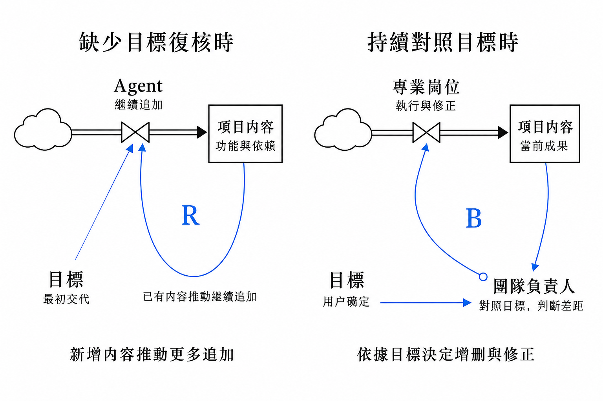
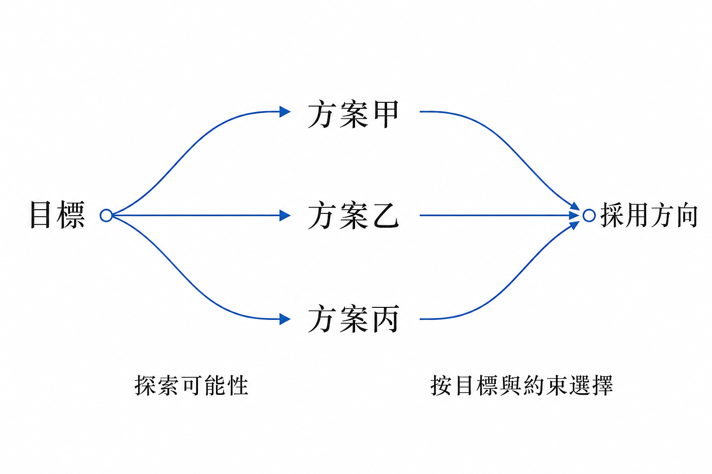
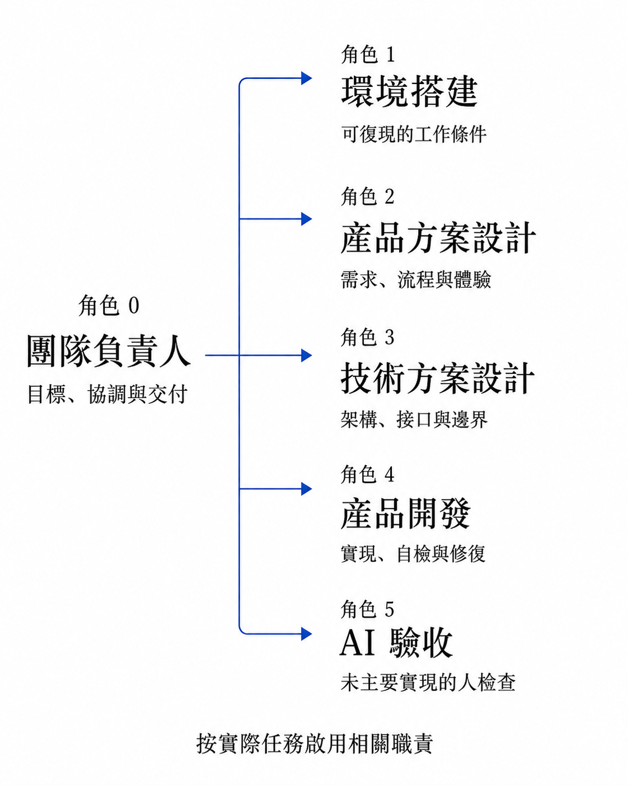
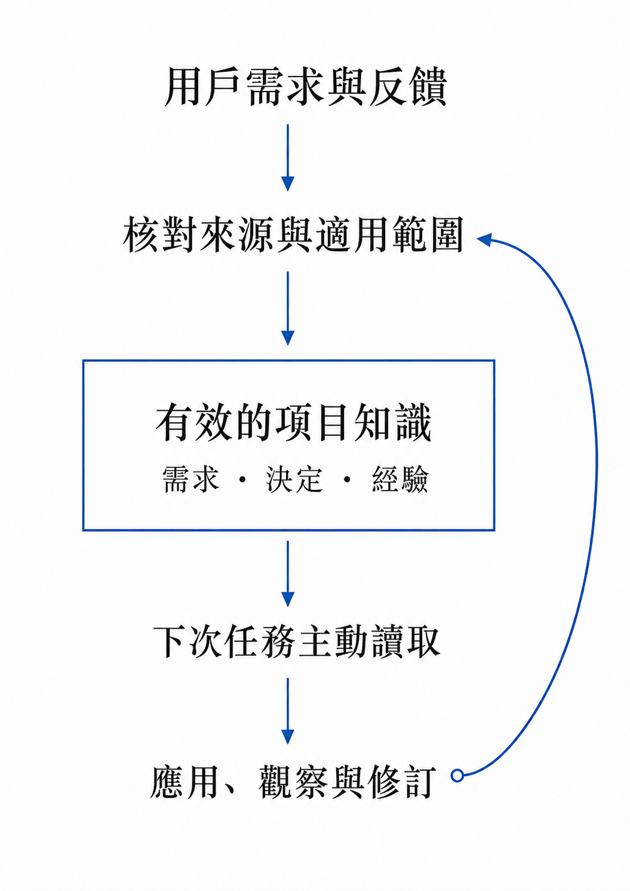
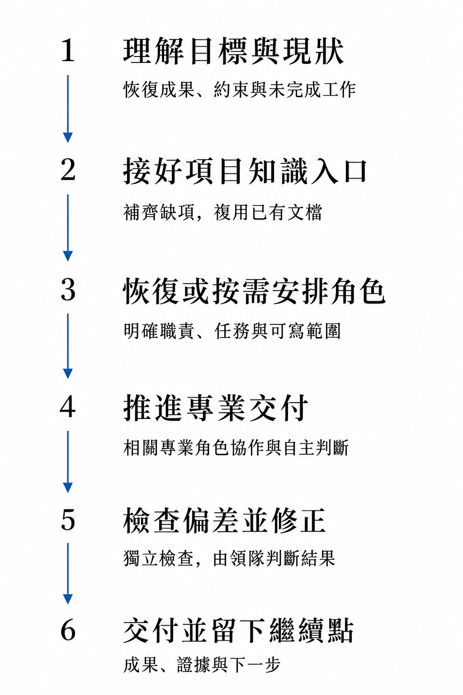
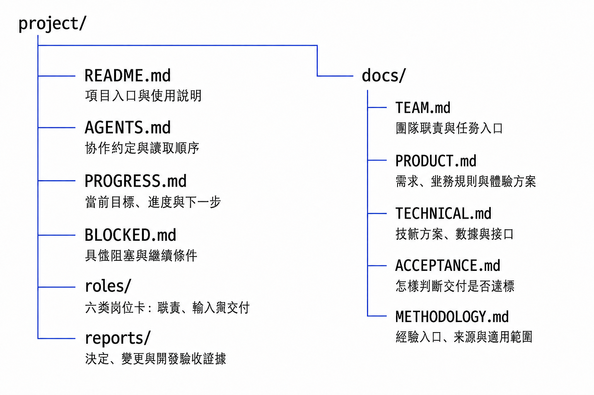
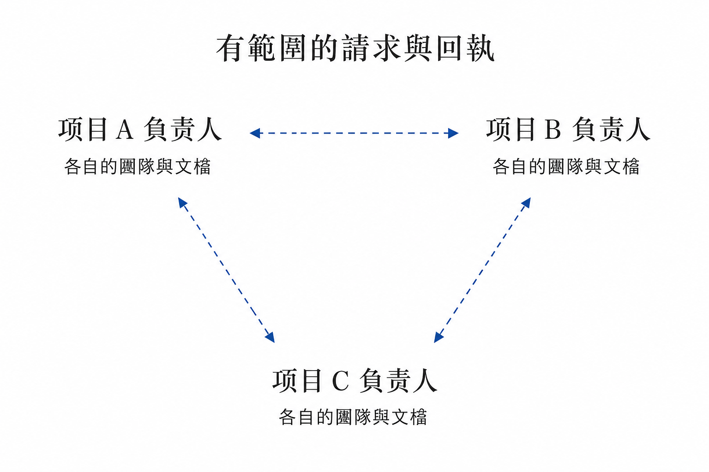

# 給 AI 項目配一位負責人，帶領團隊朝正確的方向前進

AI Design 996 · 項目介紹 · 2026-09-07 · 首次公開發布 0.5.16

[English](ARTICLE.en.md) · 繁體中文 · [简体中文](ARTICLE.md) · [分享使用場景與建議](FEEDBACK.zh-Hant.md)

**Team Leader：通過專業分工、成果檢查與及時糾偏，持續對照使用者的目標推進項目。**

用 AI 做項目，交代任務之後，使用者往往還要記著目標、在不同任務之間傳遞信息、檢查結果，再提醒下一步。項目持續得越久，這些協調工作就越容易佔據注意力。我想把其中能交給 AI 的部分，交給一位職責明確的團隊負責人。

因此，我設計了 **Team Leader**：一個面向持續項目開發的協作 Skill。這裡的負責人也是 AI 角色，Skill 用一套職責、協作方法與項目模板說明它怎樣帶隊。它依據用戶目標安排產品、技術、開發與驗收等專業工作，檢查實際成果，並在發現偏差後組織修正；已經確認的需求、決定、進度和經驗，則保存在可查找的項目文件中。

**當前主要設計與驗證對象是 GPT-6 Astra。** Sol 已有部分專業崗位的實踐記錄；模型選擇依據與尚未驗證的範圍見[模型適用性](#model-fit)。

用一句日常的話說，就是讓它“帶著團隊幹活，也盯著有沒有朝目標前進”。我希望藉此減少使用者反覆提醒、轉述上下文和協調任務的負擔。

這套方法主要面向跨多個階段、需要持續迭代的項目，例如從產品方案、技術設計一路做到開發和驗證。職責拆分也會帶來溝通與檢查成本，簡單的一次性任務可以保持簡單。後文會分別介紹設計原理、具體分工、使用方法，以及我希望大家怎樣參與改進。

**使用前也請留意額度投入：** 多崗位推理、負責人檢查和返修可能帶來較大的消耗。我已經在方法中加入分配推理級別、整理上下文和減少重複工作的策略，具體見[額度消耗與優化](#usage-cost)。

## 為什麼我從反饋迴路設計負責人

隨著上下文變長、方案反覆修改、工作交給不同角色，中間的假設和臨時選擇容易被沿用。內容一直在增加，但最初要解決的問題可能逐漸被放到一邊。我的設計重點，是讓“重新對照目標”成為有人持續負責的工作。

閱讀 Donella Meadows 的《系統之美》（*Thinking in Systems: A Primer*）後，書中關於調節反饋的描述給了我啟發：一個調節迴路需要目標、對當前狀態與目標差距的反饋，以及響應差距的行動。[1][2] 我把這個思路用在 AI 團隊協作中，讓每輪工作的結果回到負責人的觀察與判斷，再推動下一輪行動。

### 核心理念：目標、反饋、行動

在 Team Leader 中，這三個功能分別落實為：

- **目標：** 用戶說明希望交付什麼、解決什麼問題，以及需要遵守的約束。
- **反饋：** 負責人查看實際成果和檢查證據，對照目標判斷還差在哪裡。
- **行動：** 相關專業崗位依據這些差距，繼續製作、驗證或修正。

圖中的“項目內容”是當前已經形成的成果，例如方案、代碼與驗證結果。負責人觀察這些成果，與目標比較後，把差距反饋到專業崗位，推動下一輪更新。

*圖1　負責人將實際成果與用戶目標進行比較，再推動專業崗位行動。B 表示調節迴路；矩形表示當前成果，帶閥門的雙線表示執行與修正，細箭頭表示信息關係，雲朵表示未展開的來源。[2][3]*

例如，用戶希望某個頁面讓人一眼看懂信息關係。專業角色做出頁面後，負責人需要回到實際畫面與操作，判斷它有沒有達到這個目標。如果信息仍然重複、層級不清楚，就把這些差距交回相關角色修訂，再查看修訂後的結果。

目標是持續核對的參照。確實需要調整目標或作重要取捨時，負責人應把具體選擇和影響交給用戶，並記錄新的決定。調節反饋能否發揮作用，仍取決於觀察是否準確、反饋是否及時，以及修正能否落實；增加一個負責人角色本身並不能保證項目穩定。[2]

### 對比：為什麼項目可能越做越大

平常使用 Agent 時，往往是先交代任務，再根據做出的內容繼續提出修改。如果後續主要沿著已有內容往下擴展，而缺少對原目標的複核，就可能出現這樣的循環：**功能越多，衍生的配套需求與依賴越多；這些需求又被繼續納入任務，推動更多功能增加。**

*圖2　左側只在最初交代目標，已有內容推動更多追加，R 表示這種自我放大的關係。右側把目標持續帶入差距判斷，再組織修正。左圖描述一種可能的範圍膨脹機制，並非所有普通工作流都會如此。[2]*

例如，原本只需要一個簡單的記錄頁面，卻逐步加上統計面板、篩選配置，再為它們補充更多設置。如果每項衍生需求都被默認接受，工作會越來越多，卻未必更接近最初要解決的問題。這是一個說明機制的假設例子。

負責人在這裡需要作出判斷：這項新增是否服務目標，當前真正的差距是什麼，下一步應該補充、刪減，還是修正已有內容。**每一輪工作都要能說明它與目標的關係。** 單個 Agent 也可以進行這樣的檢查；Team Leader 將這件事明確為負責人的持續職責，並把修正交給有關專業崗位。

## 給創造留空間，在關鍵節點收斂

項目早期通常需要探索：產品可以怎樣組織，技術有哪幾條路線，界面是否有更好的表達。產品和技術角色應有空間提出不同方案、質疑假設、解釋取捨。

負責人需要把握不同階段的工作方式：需要探索時，讓專業角色展開候選並說明差異；準備進入實現時，依據目標與約束組織比較，明確採用哪個方向、為什麼採用。涉及重要取捨時交由用戶決定，選定的方向成為後續實現與檢查的依據。

*圖3　探索與收斂。它說明方案設計的工作方式，與圖1的調節迴路分開表達。*

例如，頁面結構尚未確定時，可以先比較不同的信息組織方式；方向確定後，再檢查實現是否兌現了這個選擇。新證據仍可以推動調整，但需要說明調整的依據。

探索與收斂是這裡的工作方式。增強迴路則需要具體的自我放大因果關係，不能只憑方案變多或箭頭成環來判斷。兩者分開表達，才能看清負責人是在什麼時候鼓勵探索、什麼時候組織選擇。[2]

## 一個負責人，五類專業職責

產品方案、技術設計、開發和驗證各自需要處理大量信息。我借鑑團隊中的專業分工，為這些工作保留持續負責的角色，由負責人協調它們之間的目標、依賴和交付。模型能力提高之後，這種分工是否仍然值得採用，取決於項目複雜度和協作成本，需要在實際使用中判斷。

*圖4　默認六類職責，包括負責人。各崗位按實際任務啟用；圖中的職責關係不表示所有崗位一直同時運行。*

圖中的編號是**職責標識，不是執行順序**。對應關係是：

- **角色0｜團隊負責人：** 維護整體目標，安排分工與依賴，查看成果與驗收證據，推動糾偏和交付。
- **角色1｜環境搭建：** 準備工具、依賴和運行環境，讓項目能夠正常運行和驗證。
- **角色2｜產品方案設計：** 明確用戶需求、業務流程和界面體驗，說明要做什麼、怎樣用。
- **角色3｜技術方案設計：** 明確實現路線、架構、數據與接口，說明怎樣做。
- **角色4｜產品開發：** 完成實現、自檢與修復。
- **角色5｜獨立 AI 驗收：** 檢查自己未主要實現的成果，判斷是否符合約定。

每個角色都有提出更好方案和異議的空間。用戶保留目標、重要取捨和最終體驗驗收；獨立 AI 驗收為這些判斷提供證據。

### 一次頁面改版，負責人怎樣帶隊

下面是一個說明工作方式的假設場景：用戶希望頁面的主要任務更容易找到，同時保留原有業務規則。

1. **把目標轉成可檢查的要求。** 負責人記錄主要任務入口、信息層級和不能改動的業務規則；產品崗位據此形成方案。
2. **安排有關崗位完成工作。** 技術崗位核對實現影響，開發崗位落實方案；環境問題影響運行時，由環境搭建崗位處理。
3. **查看實際結果，判斷差距。** 獨立 AI 驗收檢查約定的行為，負責人結合頁面與證據判斷目標是否達到。若仍有重複入口或層級問題，就交回相關崗位修正。
4. **修後複查，留下接續點。** 查看最終修改是否解決原問題，記錄採用的決定、尚未解決的事項和下一步。

這體現了我所說的“盯著幹活”：負責人要關心實際產出和它與目標的差距。能夠在現有授權內處理的工作繼續推進；確實需要用戶判斷時，帶回具體問題、推薦和影響，減少使用者在多個角色之間逐一追問。

## 讓目標、決定和經驗能接著用

負責人需要持續對照目標，就必須能找回已經確認的目標與決定。因此，我把項目知識的保存和讀取也納入了這套方法：需求為什麼這樣定，方案為什麼這樣選，上一輪做到哪裡，哪些問題還沒有解決，都應有可查找的位置。

用戶反饋裡既可能有明確需求，也可能有局部偏好或可複用的經驗。負責人結合上下文核對來源、原因與適用範圍，再放入相應記錄。下一次相關工作開始時，先讀取有效決定，完成後再用實際結果修訂。

*圖5　項目知識的沉澱與複用。記錄保存下來之後，還需要在下一次相關工作中主動讀取和應用。*

例如，“這個項目的進度卡需要就近顯示計數”可以成為項目內有效的體驗決定；它不會自動變成所有項目都採用同一種佈局的要求。後來的反饋如果改變了這個決定，也應保留變更原因，並明確哪一條現在有效。

這套“記憶”主要依靠可檢索的項目記錄。需求和方案有自己的文檔，進度有當前入口，經驗從 `docs/METHODOLOGY.md` 查找。記錄的價值，要通過後續任務實際讀取、應用和修訂來體現；保存文件本身不保證自動記住，也不等於重新訓練模型。

## 安裝以後，像和負責人說話一樣使用

**裝好以後，一句話就可以開始。** 在項目對話中選擇 Team Leader，或先點名 `$team-leader`，確認工具能夠讀取這個 Skill。接下來，像和負責人說話一樣交代工作即可。

### 第一句話：這個項目由你負責

不需要把“讀資料、問需求、安排下一步”都寫成一長串指令。選中 Skill 後，可以直接說：

> 接下來這個項目由你負責，你跟進一下。

這句話表達的是讓負責人接手。按照這套方法，它應先了解現有資料、已確認的目標和未完成工作；目標與授權已經明確時繼續推進，缺少關鍵需求時主動問你，並說明接下來準備怎樣安排。新項目如果還沒有資料，它可以先從“你想做什麼、希望解決什麼問題”聊起。你回答自己的想法即可，不必先替它設計工作流程。

這是一種簡化的使用方式，不是固定口令，也不保證任意工具都能僅憑這句話自動識別 Skill。首次先選中或點名 Team Leader；進入同一項目對話後，就可以繼續自然溝通。

如果希望採用團隊模式，可以再補一句：“請為這個項目建立完整團隊，由你負責協調。”在 0.5.16 中，決定採用團隊模式且有創建授權後，一次補齊六類崗位，之後每輪只調動需要的崗位；已有團隊則複用原來的角色和分工。實際創建仍需所用工具支持，簡單的一次性任務可以保持單人。

這不是必須逐字照抄的口令。你不需要先準備完整的產品文檔，也不用自己寫出每個崗位的任務書；先說清想做的事，細節可以在溝通中逐步補充。例如：“我想做一個分享 AI 實踐的網站，中英文都能看，也方便讀者反饋。你來負責跟進，先幫我把這個想法理清楚。”

### 首次使用與項目接手

首次使用不需要另填一個“初始化版本”。你主要做好安裝、確認項目位置和運行偏好，版本核對與資料接續由負責人處理。

**先放好完整技能包。** 拿到發佈包後，保留整個 `team-leader` 文件夾及內部相對路徑。希望在多個項目中使用，就放到個人技能目錄 `~/.agents/skills/team-leader/`；只供某個項目使用，則放到該項目的 `.agents/skills/team-leader/`。這兩種位置對應 Codex 的個人技能與項目技能範圍。[6]

在 Windows 上，個人安裝後應能找到 `%USERPROFILE%\.agents\skills\team-leader\SKILL.md`，其中 `%USERPROFILE%` 表示你的用戶目錄。不要多套一層同名文件夾，也不要只複製 `SKILL.md`；首發 0.5.16 包含 21 個 Skill 文件和 1 個 MIT 許可證，共 22 個文件。安裝後在項目的新對話中選擇或點名 `$team-leader`，先確認它能讀取技能，再用前面的接手語句開始。

[下載 Team Leader 0.5.16](https://github.com/aidesign996/ai-practice/releases/download/team-leader-v0.5.16/team-leader-0.5.16.zip) · [安裝說明、校驗文件與版本記錄](https://github.com/aidesign996/ai-practice/releases/tag/team-leader-v0.5.16)

接手時，把下面三件事對齊即可：

- **選定項目。** 在要工作的項目文件夾中開始對話，把現有資料或已有目標指給它；新項目就說明想做什麼。負責人先核對實際目錄、已有成果和有效約定，再整理需要的入口，避免重複建立已有文件或團隊。
- **選定負責人的模型與推理級別。** 如果希望採用本文主要實踐的配置，可以在所用工具中選擇 Astra，並以 `xhigh` 作為負責人起點。安裝 Skill 本身不會替你切換模型或檔位。專業崗位需要自動分配投入時，再把允許使用的模型、檔位和預算範圍交代給負責人；具體策略見[額度與優化](#usage-cost)。
- **讓負責人核對版本。** 負責人讀取實際安裝版本，再核對這個項目已採用的版本，將本次實際接續情況記在項目總覽。你不需要手改版本號，也不需要提前手工搭好整套文檔框架；負責人會複用已有資料、補齊必要入口。

這裡的“安裝版本”指工具讀取的技能包，“項目採用版本”指已經落實到這個項目的規則、資料入口和相關崗位。兩者可能暫時不同；是否接續完成，要看實際變化是否已經生效。

以後安裝了更新包，也可以直接說：“請把這個項目接續到當前安裝的 Team Leader 版本，保留已有成果、分工和未完成工作，完成後繼續原目標。”負責人核對變化、處理受影響的部分，再接著推進工作。這些信息在首次接手或發生變化時對齊，不需要每輪重新設置。

### 後面就像平常交代工作一樣

在同一個項目對話裡，繼續對這位負責人說話即可，不必每輪重寫整套協作方法。下面這些都是圍繞實際使用方式整理的例句：

- **說想法：** “我希望這個頁面更容易看懂。先給我幾個方案，我選一個後再細化。”
- **看進展：** “現在做到哪裡了？接下來準備怎麼安排？”
- **給反饋：** “這張圖太大了，信息很分散。我希望一眼能看完，文字也要清楚。”
- **繼續推進：** “這個方向可以，按剛才確定的方案繼續完成。”

你的主要工作是說目標、提出偏好、反饋實際感受，並決定重要取捨。負責人負責把這些話落實到需求、分工、成果檢查和修正中，減少你在產品、技術、開發等崗位之間反覆轉述。只想討論時可以直接說“先討論，暫時不要改”；決定推進時，再明確讓它繼續做。

### 負責人接下來會做什麼

接手後，它先理解你要交付什麼、現在已經做到哪裡，再整理有效資料的入口、接續或安排相關職責，推進工作與檢查，並留下下一輪可以繼續的位置。圖中的這些工作是負責人需要組織的內容，你可以從上面的一句日常交代開始。

*圖6　接入方法後需要形成的主要結果。實際順序按依賴安排；已有項目優先複用成果、記錄和角色。*

使用時，可以觀察負責人是否接上原目標、是否把偏差變成了修正行動，以及下一輪是否還需要你重複解釋已經確認的內容。如果它只回覆了計劃卻沒有繼續，或者仍讓你反覆提醒，這同樣是有價值的使用反饋。

### 主要面向 Astra：換成 Sol 需要注意什麼

Team Leader 面向需要處理長任務、多工具和專業協作的模型，目前主要圍繞 **GPT-6 Astra** 設計和驗證。我希望把目標、約束和驗收依據交代清楚，再給負責人組織判斷的空間，讓專業崗位自行選擇合適的方法並完成迭代。這是這套 Skill 的設計取向。

**官方說明中的差異。** OpenAI 指出 Astra 在長任務中比 Sol 更能保持連貫，同時也更容易澄清問題、更敏感地遵循 Skill 指令；委派可能偏少，檢查可能超出任務所需，因此應明確自主推進、分工和驗證的要求。[4]

所以，我想減少的是不必要的流程束縛：把過時的局部要求當成永久規則、讓每個小步驟都等待確認，或為簡單修改套上完整流程。有效的目標、權限和質量要求仍需要保留。“給模型更多專業空間”是我們的組織方式，不能概括成“Astra 本身受到的限制更少”。

**Sol 已有部分崗位的實際使用記錄。** 官方將 GPT-5.6 Sol 定位為面向複雜專業工作的模型，並列出工具調用和 Skills 支持。[5] 技能維護負責人也提供了兩項實踐，我與相應項目記錄作了核對：

- 一項界面原型任務使用 0.5.11。Sol/high 產品崗位梳理關係視圖的含義，Astra/high 開發崗位據此實現，另一個 Astra/high 崗位在瀏覽器檢查交互和窄屏表現。這次交付只覆蓋該原型。
- 一項圖稿修訂使用 0.5.14。Sol/high 產品崗位接續用戶標註，交付三處修訂，再由負責人和獨立驗收核查。圖片來自單獨的生成工具，不能把成圖質量全部歸於 Sol。

這些記錄支持 Sol 曾在混合團隊中承擔具體職責。目前沒有全 Astra 團隊與全 Sol 團隊在同一任務、輸入、質量標準和投入條件下的對照，不能斷言 Sol 一定效果差，也不能承諾兩者表現相同。

**實踐給我的提醒，是把判斷落實到成果。** 維護方還追查過一次視覺交付偏差：Astra/xhigh 的負責人和實施者都看過原圖，整體差異仍由用戶指出。因此，我更重視把完整問題交給專業崗位、讓負責人親看修後的實際成果，再由獨立驗收核對目標。這個方法判斷有具體事件支持，但還沒有模型間的效果對照；高檔位本身不能代替實際把關。

如果希望儘量貼近本文的設計與已核對經驗，建議優先使用 Astra。若使用 Sol，可以從範圍可控的任務開始，觀察它能否持續接續目標、落實專業分工、依據證據糾偏，以及最終質量、返工和總消耗。反饋時附上模型名稱、推理級別和具體場景，會比單純評價“哪個更聰明”更有助於改進。Skill 的效果還取決於所用工具提供的能力、上下文和任務難度。

### 額度消耗與優化：給判斷留餘度，減少重複投入

Team Leader 會增加負責人協調、專業崗位執行、獨立檢查以及必要返修等工作。相比一次簡單的單 Agent 請求，這種方式可能消耗更多額度，也可能需要更長時間。是否值得，要結合最終成果和包括返工在內的總投入判斷。目前還沒有同條件的整體消耗對照，不能給出固定節省比例。

**負責人和專業崗位採用不同的推理投入。** 目前這套自動分配方案主要面向 Astra，並在使用者已經同意的模型、推理級別與預算範圍內執行。負責人通常以 `xhigh` 作為默認起點，為全局判斷、依賴協調與糾偏保留餘度；專業崗位則由負責人按具體任務的複雜度和出錯影響安排：

- 輸入明確的清單整理、成熟檢查或小改動，通常從 `medium` 開始。
- 實質性的產品或技術設計、一般開發、獨立驗收判斷，按複雜度採用 `high`。
- 困難設計、跨系統約束、複雜排錯或證據衝突，可以直接採用 `xhigh`，不必先用較低檔失敗一次。

特定難題確實值得追加投入時，可在授權與工具支持範圍內考慮更高檔位，例如 `max`；不默認讓所有崗位使用最高檔。使用者明確選擇的模型與推理級別優先。這些是任務分配策略，實際設置需由所用工具支持並核實；不能把一段文字指令當成已經改變了運行設置，也不意味著負責人能自行修改當前正在運行這一輪的級別。

**專業崗位開工前，先判斷哪些上下文真正需要攜帶。** 派工時優先傳遞當前目標、有效約束、本輪變化和必要證據，其餘歷史保留可追溯入口。階段結束、交接、方向變化，或舊信息已經干擾判斷時，由負責人組織一份精簡的有效狀態說明，保留已完成成果、未完成工作、當前分工、重要經驗和下一步，圖片等關鍵原件仍可直接查看。

這裡採用的是有條件的整理與壓縮，不是每次開工都清空歷史或重建任務。只有工具確實提供合適的上下文壓縮能力時，才在不打斷在途工作的邊界使用，並檢查目標和約束是否接續。寫了摘要本身並不會縮短活動會話；壓縮、重新讀取也有成本，不能預設一定更省。

目前尚未驗證負責人能自動壓縮各崗位會話；已確認的優化重點是整理有效信息、複用記錄與減少重複輸入。

**減少重複工作，並在擴大投入前看額度。** 複用仍有效的調查和檢查結果，篩選必要的工具輸出，避免負責人重複執行開發自檢和獨立驗收的全部工作，也避免反覆詢問沒有變化的狀態。新任務或投入明顯擴大前，在工具支持時檢查共享賬戶的剩餘額度；明顯不足時說明現狀和可選安排。既有授權內的工作正常推進，不把成本意識變成每一步都等用戶確認。

這些分配與上下文管理規則已寫入核對過的 0.5.13 協議，並在首發 0.5.16 源碼中保留。規則存在、運行設置實際生效、最終節省多少，是需要分別核實的三件事。我會保留足夠的判斷和驗證投入，也歡迎大家反饋哪些環節消耗較大、產生了什麼價值，以及哪裡可以減少重複。

## 文件框架：每類信息有可找到的位置

文件框架服務於團隊接續工作。新項目可以從隨包模板開始，已有項目則複用有效資料，補齊缺少的入口。不同職責找到自己的依據後，才能圍繞同一組目標與決定協作。

*圖7　當前模板提供的項目知識框架。文件結構示意不代表文檔已經填完，也不代表項目已經完成。*

可以按日常工作中的問題來理解這些文件：

- **項目是什麼、接下來做什麼：** `README.md` 提供總覽；`PROGRESS.md` 記錄當前進度與下一步；`BLOCKED.md` 記錄尚未解決的阻塞。
- **怎樣協作、由誰負責：** `AGENTS.md` 說明項目約定與讀取路線；`docs/TEAM.md` 與 `roles/` 保存分工和角色相關資料。
- **做什麼、怎樣做、怎樣算完成：** 分別從 `docs/PRODUCT.md`、`docs/TECHNICAL.md`、`docs/ACCEPTANCE.md` 查找產品、技術和驗收約定。
- **為什麼作這個決定、驗證到了什麼：** `reports/` 保留過程與檢查依據，`docs/METHODOLOGY.md` 提供經驗的讀取入口。

這些是項目工作資料。Skill 的安裝包則包含 `SKILL.md`、方法參考和模板，應保留完整包及相對路徑；其中的 `agents/openai.yaml` 是界面配置，與項目的 `AGENTS.md` 用途不同。

### 後續迭代：給持續修改的成果保留版本

在 **0.5.15** 中，我補充了成果版本管理的規則：負責人在接手項目或工作發生實質變化時，判斷代碼、腳本、持續修訂的文檔和設計稿是否留有可比較、可恢復的版本。已有有效機制就繼續使用；確實需要卻缺失時，在授權內組織補齊，並核實重要文件已經進入實際版本記錄。這樣，後續修改才有可對照、可取回的依據。普通一次性任務不強制使用 Git。

這項增量已通過結構檢查、獨立文本審閱和本機安裝一致性核對。**僅靠技能更新，能否讓負責人在真實項目中自主發現並糾正這類遺漏，仍待驗證。** 本地版本管理也不等於已經公開到 GitHub，或已經做好異地備份與線上回滾。

### 0.5.16：完整建隊，按需調動

首發版進一步區分“是否需要團隊”和“本輪需要哪些崗位”：採用團隊模式並具備授權後，一次補齊完整六崗架構，複用已有角色，之後按任務調動有關崗位。工作範圍變化時，負責人也需要重新判斷當前安排是否足夠。小任務仍可單人完成，用戶限制和實際工具能力優先。

公開包已通過技能基礎結構、相對引用、22 文件的壓縮包與乾淨目錄解壓一致性檢查；另有四個合成情境的獨立規則審閱。這些檢查不等於新賬號完整實時團隊或長期效果驗證。

## 進一步的方向：負責人之間怎樣協作

當多個項目有關聯時，我希望把這種協作進一步延伸到負責人之間：一個負責人提出需要什麼資料、解決什麼問題，另一位負責人結合自己的項目作出回應，各自繼續維護本項目的團隊、成果和知識。

*圖8　跨項目協作的擴展方向。虛線表示溝通關係，不表示已經提供常駐自動調度服務。*

本次分享準備中，分享負責人向技能維護負責人和實際使用過的項目負責人收集資料，就是一次有具體範圍的跨項目溝通。目前它依賴宿主可用的通信工具和實際授權；未來可以進一步完善請求、回執、依賴與反饋的組織方式。

這些交流應傳遞完成當前任務所需的信息。某個項目中的業務內容、局部偏好或修改權限，不會因為負責人之間可以溝通就自動變成其他項目的共同規則。

## 歡迎把真實工作中的問題帶回來

本文設計說明從已核對的 **0.5.13** 整理而來；首次公開包為 **0.5.16**，包含 21 個 Skill 文件及 1 個 MIT 許可證，後續增量在相應段落單獨說明。主要設計與驗證對象為 GPT-6 Astra，已有實踐主要來自 Windows 上的 Codex 桌面應用。Sol 已有混合團隊中的部分崗位實踐，尚無全 Sol 團隊的同條件效果對照；其他系統或 Agent 平臺也尚未完成同等範圍的兼容驗證。上述安裝路徑已與本機實踐和官方說明核對，但尚未完成乾淨機器或新賬號從安裝到完整團隊交付的全流程驗證。

**Team Leader 0.5.16 以 MIT 許可證公開，歡迎試用。** [版本頁面](https://github.com/aidesign996/ai-practice/releases/tag/team-leader-v0.5.16)提供完整安裝包、說明與文件校驗清單。可以先從目標清楚、範圍可控的小項目試用，再判斷它是否適合更複雜的工作。

**歡迎試用後帶著真實工作中的問題來交流，也歡迎現在就討論設計與適用場景。** 我會結合大家的反饋繼續優化這套 Skill。網頁文章下方就是評論區，用英文、繁體中文或簡體中文直接寫就好，不用分欄填寫，也不用先分析技術原因。

可以聊聊當時想做什麼、實際發生了什麼、怎樣會更好；知道多少就寫多少，有用的體驗同樣歡迎分享。後續的整理、場景核對和改進分析，由我和技能維護負責人跟進。

例如：“我讓負責人繼續修改頁面，它只回覆了計劃，沒有繼續做。我還得追問一次。希望它能在已有授權內繼續完成；確實需要我決定時，再說明具體卡在哪裡。”這是反饋表達的示例，無需整理成技術報告。

[到文章下方看留言、分享你的使用場景](FEEDBACK.zh-Hant.md)

你可以在文章下方查看留言、發表評論和回覆，三種語言共用同一個討論區。首次留言需要登錄 GitHub 並授權評論組件 giscus，之後可以在文章內繼續交流。點擊發布後，留言會公開保存到分享倉庫的 GitHub Discussions，其他人也能閱讀和補充經歷。版本、使用工具和已去除私人信息的截圖有助於理解，但可以在需要時再補充。

我會先理解場景與原目標，再判斷是當前項目的局部需要，還是值得納入 Skill 的通用改進。確定調整後，回到原場景檢查，並說明改了什麼、驗證到哪裡、還有哪些限制。你可以在同一條反饋中繼續補充結果；暫時沒有解決的問題也應保留，供後續跟進。

我也在改進驗證方法：如果要判斷新版是否讓負責人更主動，後續會在完成修訂、必要檢查與安裝後，讓負責人讀取新版，不預先點明待觀察的具體遺漏，再觀察它是否自行發現適用的問題、組織修正並檢查結果。“明確指出問題後完成修復”和“自主發現並糾偏”會分別評價。這是後續維護的驗證方法；本輪版本管理增量的後一項效果尚未驗證。

我最希望從這些反饋中瞭解的是：負責人在哪些時候幫你接住了工作，又在哪些時候仍需要你反覆提醒。讓它更好地帶領團隊圍繞目標推進，是我會持續實踐和改進的方向。

## 參考與圖示說明

1. Donella H. Meadows，*Thinking in Systems: A Primer*，Diana Wright 編輯，2008。[出版社介紹](https://chelseagreen.co.uk/book/thinking-in-systems/)。
2. Donella Meadows，[Leverage Points: Places to Intervene in a System](https://donellameadows.org/archives/leverage-points-places-to-intervene-in-a-system/)，其中關於增強反饋、調節反饋、目標、監測與響應機制的論述。
3. 原書第36頁圖15的圖示形式參考：[英文節選，第35—72頁](https://www.gc.soton.ac.uk/files/2015/01/Thinking-in-Systems35-72.pdf)。
4. OpenAI，[GPT-6 Astra 使用與提示指南](https://developers.openai.com/api/docs/guides/latest-model)，尤其長任務連貫性、指令敏感性、委派和驗證的說明，核對日期：2026-09-07。
5. OpenAI，[GPT-5.6 Sol 模型說明](https://developers.openai.com/api/docs/models/gpt-5.6-sol)，核對日期：2026-09-07。模型能力說明與本 Skill 的兼容驗證是不同依據。
6. OpenAI，[Codex 自定義：技能](https://learn.chatgpt.com/zh-Hans/docs/customization/overview#技能)，個人與項目技能目錄、技能組成及調用方式，核對日期：2026-09-07。

本文八張配圖為結合 Team Leader 內容設計的概念示意，經 imagegen 製作或優化，並核對文字與關係。圖1和圖2借用原書的存量、流量與信息反饋符號，解釋用戶目標、負責人判斷和專業崗位行動之間的關係；流線概括內容的追加或更新，未建立可計算的存量與變化速率模型。其餘圖解釋本項目的設計。配圖是本文示意，不是原書原圖、運行截圖或效果證據。主體文件與行為說明以已核對的 0.5.13 源包為依據，後續增量及其驗證範圍另行標明，英文、繁體中文與簡體中文版本表達同一內容。
